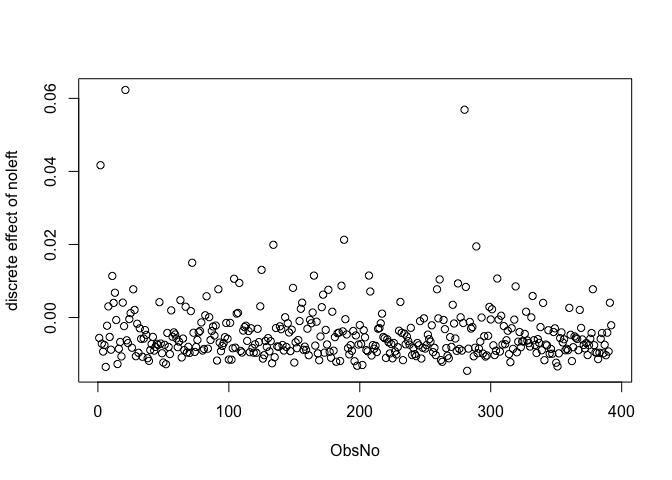

# fracreg: Fractional Response Regressions


[](https://lifecycle.r-lib.org/articles/stages.html#stable)
[](https://cran.r-project.org/)
[](https://github.com/SulmanOlieko/fracreg/commits/main)
[](https://github.com/SulmanOlieko/fracreg/issues)
[](https://github.com/SulmanOlieko/fracreg/actions/workflows/R-CMD-check.yaml)

[](https://github.com/SulmanOlieko/fracreg)
[](https://github.com/SulmanOlieko/fracreg)
[](https://github.com/SulmanOlieko/fracreg)

[](https://cran.r-project.org/package=fracreg)
[](https://cran.r-project.org/package=fracreg)
[](https://cran.r-project.org/package=fracreg)
[](https://cran.r-project.org/package=fracreg)

[](https://github.com/SulmanOlieko/fracreg)
[](https://CRAN.R-project.org/package=fracreg)

An R package for fitting and testing specifications of fractional
regression models. It handles fractional, univariate proportions, and
bounded data ($`0 \le y \le 1`$), and provides estimators for one-part,
two-part (hurdle), and three-part (double-inflated) models. It also
extends fractional modelling to multivariate data through fractional
multinomial logit and introduces fractional ridge regression for
multicollinear, high-dimensional datasets.

## Features

`fracreg` handles:

1.  **Univariate Fractional Models (`fracreg`)**: Fit standard 1-part
    models, hurdle 2-part models (mass at 0 or 1), and double-inflated
    3-part models.
2.  **Panel Data Models (`fracregpd`)**: Estimate fractional models with
    fixed-T longitudinal data, supporting Correlated Random Effects
    (CRE) to handle unobserved individual heterogeneity.
3.  **Endogeneity & Heteroscedasticity (`fracreghet`)**: Correct for
    endogenous covariates using Instrumental Variables (IV) via Control
    Function and GMM approaches.
4.  **Fractional Multinomial Logit (`fracregmlogit`)**: Estimate
    multivariate fractional responses where outcomes across multiple
    categories sum to 1.
5.  **Fractional Ridge Regression (`fracregridge`)**: Perform L2
    regularization using dynamic fraction penalties of the unregularized
    vector length.
6.  **Diagnostic Testing**: Includes model-specific routines for
    generalised goodness-of-functional-form, RESET, and non-nested
    P-tests (e.g., `fracreg.ggoff`, `fracreghet.reset`,
    `fracreg.ptest`).
7.  **Analytical Partial Effects**: Compute exact marginal effects for
    all model types via the Delta method using their respective
    functions (e.g.,
    [`fracreg.pe()`](https://sulmanolieko.github.io/fracreg/reference/fracreg.pe.md),
    [`fracregpd.pe()`](https://sulmanolieko.github.io/fracreg/reference/fracregpd.pe.md),
    [`fracreghet.pe()`](https://sulmanolieko.github.io/fracreg/reference/fracreghet.pe.md),
    [`fracregridge.pe()`](https://sulmanolieko.github.io/fracreg/reference/fracregridge.pe.md),
    and
    [`fracregmlogit.pe()`](https://sulmanolieko.github.io/fracreg/reference/fracregmlogit.pe.md)).
8.  **Native S3 Integration & NA Handling**: Provides standard
    extractors ([`coef()`](https://rdrr.io/r/stats/coef.html),
    [`predict()`](https://rdrr.io/r/stats/predict.html),
    [`fitted()`](https://sulmanolieko.github.io/fracreg/reference/fitted.fracregmlogit.md),
    [`residuals()`](https://rdrr.io/r/stats/residuals.html),
    [`vcov()`](https://rdrr.io/r/stats/vcov.html),
    [`logLik()`](https://rdrr.io/r/stats/logLik.html),
    [`nobs()`](https://rdrr.io/r/stats/nobs.html)) and native
    `na.action` missing data handling across all estimators.

------------------------------------------------------------------------

## Installation

You can install the released version of `fracreg` from CRAN with:

``` r

install.packages("fracreg")
library("fracreg")
```

Or install the development version from GitHub:

``` r

# install.packages("devtools")
devtools::install_github("SulmanOlieko/fracreg")
```

------------------------------------------------------------------------

## Usage Examples

This guide walks you through comprehensive empirical examples (using the
401(k) dataset) and simulated examples for each estimator.

### Data Description and Preparation

We use the built-in `fracreg_k401k` dataset, which is the canonical
firm-level 401(k) plan participation data used in **Papke and Wooldridge
(1996)** (*“Econometric methods for fractional response variables with
an application to 401(k) plan participation rates”*, Journal of Applied
Econometrics). The dataset contains 1,534 observations of 401(k) plans.

The primary variables we use are: - `prate`: The plan participation rate
(the fraction of eligible employees who are active participants). It
strictly falls in the $`[0, 1]`$ interval and is our dependent variable
($`y`$). - `mrate`: The firm’s matching rate (the firm’s contribution
per \$1 of employee contribution). - `age`: The age of the 401(k)
plan. - `totemp`: Total number of employees at the firm. - `sole`: A
binary indicator equal to 1 if the 401(k) plan is the sole retirement
plan offered by the firm.

### 1. Cross-Sectional Fractional Models (`fracreg`)

The core
[`fracreg()`](https://sulmanolieko.github.io/fracreg/reference/fracreg.md)
function is designed for univariate models where the dependent variable
is bounded between 0 and 1 inclusive ($`0 \le y \le 1`$). The examples
below demonstrate both empirical 401(k) plan participation data and
general simulated boundaries.

``` r

### Empirical 401(k) Examples 
data("fracreg_k401k") 
y <- fracreg_k401k$prate 
X <- cbind(mrate = fracreg_k401k$mrate, age = fracreg_k401k$age,  
           totemp = fracreg_k401k$totemp, sole = fracreg_k401k$sole) 
 
# 1P Model 
mod <- fracreg(y, X, type="1P", linkfrac="logit") 
summary(mod)
```

Toggle to see the output

``` R
#> 
#> -------------------------------------------------------------------------------- 
#>                           Fractional logit regression 
#> -------------------------------------------------------------------------------- 
#> Data type:                                                       Cross-sectional 
#> Estimator:                                                                   QML 
#> Convergence:                                                          Successful 
#> Number of observations:                                                     1534 
#> Log pseudolikelihood:                                                  -553.1626 
#> Pseudo R-squared:                                                        0.14667 
#> Wald chi2(4):                                                           147.3049 
#> Prob > chi2:                                                              0.0000 
#> Standard errors:                                                             HC0 
#> Small sample correction:                                                   FALSE 
#> -------------------------------------------------------------------------------- 
#>                     Final Quasi-Maximum Likelihood estimates 
#> -------------------------------------------------------------------------------- 
#>             Coefficient Robust Std.Err.    z value [95% Conf. Interval]
#> (Intercept)   9.316e-01       8.408e-02  1.108e+01  7.668e-01     1.096
#> mrate         9.531e-01       1.371e-01  6.951e+00  6.843e-01     1.222
#> age           2.791e-02       4.877e-03  5.723e+00  1.835e-02     0.037
#> totemp       -8.182e-06       3.061e-06 -2.673e+00 -1.418e-05     0.000
#> sole          3.405e-01       8.066e-02  4.222e+00  1.824e-01     0.499
#>             Pr(>|z|)    
#> (Intercept)  < 2e-16 ***
#> mrate       3.62e-12 ***
#> age         1.05e-08 ***
#> totemp       0.00751 ** 
#> sole        2.43e-05 ***
#> ---
#> Signif. codes:  0 '***' 0.001 '**' 0.01 '*' 0.05 '.' 0.1 ' ' 1
#> -------------------------------------------------------------------------------- 
#>                          Run Date: 2026-07-15 21:59:01 
#> --------------------------------------------------------------------------------
```

``` r


# 1P Model reporting odds ratios and 99% confidence intervals
mod <- fracreg(y, X, type="1P", linkfrac="logit", or=TRUE, level=0.99)
summary(mod)
```

Toggle to see the output

``` R
#> 
#> -------------------------------------------------------------------------------- 
#>                           Fractional logit regression 
#> -------------------------------------------------------------------------------- 
#> Data type:                                                       Cross-sectional 
#> Estimator:                                                                   QML 
#> Convergence:                                                          Successful 
#> Number of observations:                                                     1534 
#> Log pseudolikelihood:                                                  -553.1626 
#> Pseudo R-squared:                                                        0.14667 
#> Wald chi2(4):                                                           147.3049 
#> Prob > chi2:                                                              0.0000 
#> Standard errors:                                                             HC0 
#> Small sample correction:                                                   FALSE 
#> -------------------------------------------------------------------------------- 
#>                     Final Quasi-Maximum Likelihood estimates 
#> -------------------------------------------------------------------------------- 
#>             Odds Ratio Robust Std.Err.    z value [99% Conf. Interval] Pr(>|z|)
#> (Intercept)  2.539e+00       2.134e-01  1.108e+01  2.044e+00     3.153  < 2e-16
#> mrate        2.594e+00       3.556e-01  6.951e+00  1.822e+00     3.692 3.62e-12
#> age          1.028e+00       5.015e-03  5.723e+00  1.015e+00     1.041 1.05e-08
#> totemp       1.000e+00       3.061e-06 -2.673e+00  1.000e+00     1.000  0.00751
#> sole         1.406e+00       1.134e-01  4.222e+00  1.142e+00     1.730 2.43e-05
#>                
#> (Intercept) ***
#> mrate       ***
#> age         ***
#> totemp      ** 
#> sole        ***
#> ---
#> Signif. codes:  0 '***' 0.001 '**' 0.01 '*' 0.05 '.' 0.1 ' ' 1
#> -------------------------------------------------------------------------------- 
#>                          Run Date: 2026-07-15 21:59:01 
#> --------------------------------------------------------------------------------
```

``` r

 
# 2P Model (modelling mass at 1) 
mod <- fracreg(y, X, type="2P", inflation=1, linkbin="logit", linkfrac="logit") 
summary(mod)
```

Toggle to see the output

``` R
#> 
#> -------------------------------------------------------------------------------- 
#>                         Part 1: Binary logit regression 
#> -------------------------------------------------------------------------------- 
#> Data type:                                                       Cross-sectional 
#> Estimator:                                                                    ML 
#> Convergence:                                                          Successful 
#> Number of observations:                                                     1534 
#> Log-likelihood:                                                        -938.1759 
#> Pseudo R-squared:                                                         0.1485 
#> Wald chi2(4):                                                           173.5169 
#> Prob > chi2:                                                              0.0000 
#> Small sample correction:                                                   FALSE 
#> -------------------------------------------------------------------------------- 
#>                        Final Maximum Likelihood estimates 
#> -------------------------------------------------------------------------------- 
#>             Coefficient EIM Std.Err.    z value [95% Conf. Interval] Pr(>|z|)
#> (Intercept)  -1.396e+00    1.270e-01 -1.099e+01 -1.645e+00    -1.147   <2e-16
#> mrate         9.053e-01    9.699e-02  9.334e+00  7.152e-01     1.095   <2e-16
#> age           1.156e-02    6.218e-03  1.858e+00 -6.312e-04     0.024   0.0631
#> totemp       -1.418e-05    6.324e-06 -2.242e+00 -2.657e-05     0.000   0.0249
#> sole          8.651e-01    1.131e-01  7.651e+00  6.435e-01     1.087    2e-14
#>                
#> (Intercept) ***
#> mrate       ***
#> age         .  
#> totemp      *  
#> sole        ***
#> ---
#> Signif. codes:  0 '***' 0.001 '**' 0.01 '*' 0.05 '.' 0.1 ' ' 1
#> -------------------------------------------------------------------------------- 
#> 
#> 
#> -------------------------------------------------------------------------------- 
#>                       Part 2: Fractional logit regression 
#> -------------------------------------------------------------------------------- 
#> Data type:                                                       Cross-sectional 
#> Estimator:                                                                   QML 
#> Convergence:                                                          Successful 
#> Number of observations:                                                      852 
#> Log pseudolikelihood:                                                  -450.8391 
#> Pseudo R-squared:                                                        0.10004 
#> Wald chi2(4):                                                            65.4063 
#> Prob > chi2:                                                              0.0000 
#> Standard errors:                                                             HC0 
#> Small sample correction:                                                   FALSE 
#> -------------------------------------------------------------------------------- 
#>                     Final Quasi-Maximum Likelihood estimates 
#> -------------------------------------------------------------------------------- 
#>             Coefficient Robust Std.Err.    z value [95% Conf. Interval]
#> (Intercept)   7.460e-01       6.850e-02  1.089e+01  6.118e-01     0.880
#> mrate         3.877e-01       9.725e-02  3.987e+00  1.971e-01     0.578
#> age           2.562e-02       4.010e-03  6.390e+00  1.777e-02     0.033
#> totemp       -4.061e-06       3.073e-06 -1.322e+00 -1.008e-05     0.000
#> sole         -1.510e-02       6.556e-02 -2.303e-01 -1.436e-01     0.113
#>             Pr(>|z|)    
#> (Intercept)  < 2e-16 ***
#> mrate       6.69e-05 ***
#> age         1.66e-10 ***
#> totemp         0.186    
#> sole           0.818    
#> ---
#> Signif. codes:  0 '***' 0.001 '**' 0.01 '*' 0.05 '.' 0.1 ' ' 1
#> -------------------------------------------------------------------------------- 
#> 
#> 
#> -------------------------------------------------------------------------------- 
#>         Two-part fractional regression: binary logit + fractional logit 
#> -------------------------------------------------------------------------------- 
#> Data type:                                                       Cross-sectional 
#> Convergence:                                                          Successful 
#> Pseudo R-squared:                                                        0.11243 
#> -------------------------------------------------------------------------------- 
#>                          Run Date: 2026-07-15 21:59:02 
#> --------------------------------------------------------------------------------
```

``` r

 
# 3P Model (inject artificial 0s for demonstration) 
y_3p <- y; y_3p[1:50] <- 0 
mod <- fracreg(y_3p, X, type="3P", linkbin=c("logit","logit"), linkfrac="logit") 
summary(mod)
```

Toggle to see the output

``` R
#> 
#> -------------------------------------------------------------------------------- 
#>                         Part 1: Binary logit regression 
#> -------------------------------------------------------------------------------- 
#> Data type:                                                       Cross-sectional 
#> Estimator:                                                                    ML 
#> Convergence:                                                          Successful 
#> Number of observations:                                                     1534 
#> Log-likelihood:                                                        -216.6222 
#> Pseudo R-squared:                                                        0.00324 
#> Wald chi2(4):                                                             3.7679 
#> Prob > chi2:                                                              0.4383 
#> Small sample correction:                                                   FALSE 
#> -------------------------------------------------------------------------------- 
#>                        Final Maximum Likelihood estimates 
#> -------------------------------------------------------------------------------- 
#>             Coefficient EIM Std.Err.    z value [95% Conf. Interval] Pr(>|z|)
#> (Intercept)   2.867e+00    3.157e-01  9.080e+00  2.248e+00     3.486   <2e-16
#> mrate         1.147e-01    2.131e-01  5.381e-01 -3.030e-01     0.532    0.590
#> age           8.375e-03    1.765e-02  4.745e-01 -2.622e-02     0.043    0.635
#> totemp        1.036e-04    6.959e-05  1.489e+00 -3.275e-05     0.000    0.136
#> sole          3.371e-01    2.983e-01  1.130e+00 -2.476e-01     0.922    0.259
#>                
#> (Intercept) ***
#> mrate          
#> age            
#> totemp         
#> sole           
#> ---
#> Signif. codes:  0 '***' 0.001 '**' 0.01 '*' 0.05 '.' 0.1 ' ' 1
#> -------------------------------------------------------------------------------- 
#> 
#> 
#> -------------------------------------------------------------------------------- 
#>                         Part 2: Binary logit regression 
#> -------------------------------------------------------------------------------- 
#> Data type:                                                       Cross-sectional 
#> Estimator:                                                                    ML 
#> Convergence:                                                          Successful 
#> Number of observations:                                                     1484 
#> Log-likelihood:                                                        -903.5457 
#> Pseudo R-squared:                                                        0.15199 
#> Wald chi2(4):                                                            172.201 
#> Prob > chi2:                                                              0.0000 
#> Small sample correction:                                                   FALSE 
#> -------------------------------------------------------------------------------- 
#>                        Final Maximum Likelihood estimates 
#> -------------------------------------------------------------------------------- 
#>             Coefficient EIM Std.Err.    z value [95% Conf. Interval] Pr(>|z|)
#> (Intercept)  -1.435e+00    1.306e-01 -1.099e+01 -1.691e+00    -1.179  < 2e-16
#> mrate         9.244e-01    9.877e-02  9.360e+00  7.309e-01     1.118  < 2e-16
#> age           1.198e-02    6.339e-03  1.890e+00 -4.453e-04     0.024   0.0588
#> totemp       -1.371e-05    6.317e-06 -2.170e+00 -2.609e-05     0.000   0.0300
#> sole          8.852e-01    1.154e-01  7.674e+00  6.591e-01     1.111 1.67e-14
#>                
#> (Intercept) ***
#> mrate       ***
#> age         .  
#> totemp      *  
#> sole        ***
#> ---
#> Signif. codes:  0 '***' 0.001 '**' 0.01 '*' 0.05 '.' 0.1 ' ' 1
#> -------------------------------------------------------------------------------- 
#> 
#> 
#> -------------------------------------------------------------------------------- 
#>                       Part 3: Fractional logit regression 
#> -------------------------------------------------------------------------------- 
#> Data type:                                                       Cross-sectional 
#> Estimator:                                                                   QML 
#> Convergence:                                                          Successful 
#> Number of observations:                                                      826 
#> Log pseudolikelihood:                                                  -437.3715 
#> Pseudo R-squared:                                                        0.09937 
#> Wald chi2(4):                                                            62.3685 
#> Prob > chi2:                                                              0.0000 
#> Standard errors:                                                             HC0 
#> Small sample correction:                                                   FALSE 
#> -------------------------------------------------------------------------------- 
#>                     Final Quasi-Maximum Likelihood estimates 
#> -------------------------------------------------------------------------------- 
#>             Coefficient Robust Std.Err.    z value [95% Conf. Interval]
#> (Intercept)   7.388e-01       7.039e-02  1.050e+01  6.008e-01     0.877
#> mrate         3.960e-01       1.019e-01  3.885e+00  1.962e-01     0.596
#> age           2.531e-02       4.068e-03  6.223e+00  1.734e-02     0.033
#> totemp       -3.817e-06       3.088e-06 -1.236e+00 -9.869e-06     0.000
#> sole         -4.483e-03       6.672e-02 -6.719e-02 -1.353e-01     0.126
#>             Pr(>|z|)    
#> (Intercept)  < 2e-16 ***
#> mrate       0.000102 ***
#> age         4.88e-10 ***
#> totemp      0.216472    
#> sole        0.946434    
#> ---
#> Signif. codes:  0 '***' 0.001 '**' 0.01 '*' 0.05 '.' 0.1 ' ' 1
#> -------------------------------------------------------------------------------- 
#> 
#> 
#> -------------------------------------------------------------------------------- 
#> Three-part fractional regression: binary logit , binary logit + fractional logit 
#> -------------------------------------------------------------------------------- 
#> Data type:                                                       Cross-sectional 
#> Convergence:                                                          Successful 
#> Pseudo R-squared:                                                        0.07934 
#> -------------------------------------------------------------------------------- 
#>                          Run Date: 2026-07-15 21:59:02 
#> --------------------------------------------------------------------------------
```

``` r

 
### Simulated Examples 
 
set.seed(123) 
N <- 1000 
x1 <- rnorm(N) 
x2 <- runif(N) 
 
# Generating a fractional dependent variable with inflation at 0 and 1 
XB <- -0.5 + 0.8 * x1 + 1.2 * x2 + rnorm(N) 
y_latent <- exp(XB) / (1 + exp(XB)) 
 
y <- y_latent 
# Inflate at boundaries 
y[y_latent < 0.2] <- 0 
y[y_latent > 0.8] <- 1 
 
X <- cbind(x1 = x1, x2 = x2) 
 
# fracreg estimation of a logit fractional response model 
mod <- fracreg(y, X, type="1P", linkfrac="logit") 
summary(mod)
```

Toggle to see the output

``` R
#> 
#> -------------------------------------------------------------------------------- 
#>                           Fractional logit regression 
#> -------------------------------------------------------------------------------- 
#> Data type:                                                       Cross-sectional 
#> Estimator:                                                                   QML 
#> Convergence:                                                          Successful 
#> Number of observations:                                                     1000 
#> Log pseudolikelihood:                                                   -614.973 
#> Pseudo R-squared:                                                         0.3903 
#> Wald chi2(2):                                                           472.2453 
#> Prob > chi2:                                                              0.0000 
#> Standard errors:                                                             HC0 
#> Small sample correction:                                                   FALSE 
#> -------------------------------------------------------------------------------- 
#>                     Final Quasi-Maximum Likelihood estimates 
#> -------------------------------------------------------------------------------- 
#>             Coefficient Robust Std.Err.  z value [95% Conf. Interval] Pr(>|z|)
#> (Intercept)    -0.56969         0.06750 -8.43960   -0.70199    -0.437   <2e-16
#> x1              0.78822         0.04015 19.63424    0.70954     0.867   <2e-16
#> x2              1.35611         0.11899 11.39668    1.12289     1.589   <2e-16
#>                
#> (Intercept) ***
#> x1          ***
#> x2          ***
#> ---
#> Signif. codes:  0 '***' 0.001 '**' 0.01 '*' 0.05 '.' 0.1 ' ' 1
#> -------------------------------------------------------------------------------- 
#>                          Run Date: 2026-07-15 21:59:02 
#> --------------------------------------------------------------------------------
```

``` r

 
# fracreg estimation of the binary logit component of the two-part fractional 
# regression model with y=0 as the relevant boundary value 
mod <- fracreg(y, X, type="2Pbin", inflation=0, linkbin="logit") 
summary(mod)
```

Toggle to see the output

``` R
#> 
#> -------------------------------------------------------------------------------- 
#>                         Part 1: Binary logit regression 
#> -------------------------------------------------------------------------------- 
#> Data type:                                                       Cross-sectional 
#> Estimator:                                                                    ML 
#> Convergence:                                                          Successful 
#> Number of observations:                                                     1000 
#> Log-likelihood:                                                        -295.2068 
#> Pseudo R-squared:                                                        0.14527 
#> Wald chi2(2):                                                           102.5171 
#> Prob > chi2:                                                              0.0000 
#> Small sample correction:                                                   FALSE 
#> -------------------------------------------------------------------------------- 
#>                        Final Maximum Likelihood estimates 
#> -------------------------------------------------------------------------------- 
#>             Coefficient EIM Std.Err. z value [95% Conf. Interval] Pr(>|z|)    
#> (Intercept)      1.4638       0.1933  7.5732     1.0849     1.843 3.64e-14 ***
#> x1               1.1857       0.1287  9.2126     0.9335     1.438  < 2e-16 ***
#> x2               2.2279       0.3932  5.6662     1.4572     2.999 1.46e-08 ***
#> ---
#> Signif. codes:  0 '***' 0.001 '**' 0.01 '*' 0.05 '.' 0.1 ' ' 1
#> --------------------------------------------------------------------------------
```

``` r

 
# fracreg estimation of the fractional component of the two-part fractional 
# regression model with y=0 as the relevant boundary value and using a 
# probit link function 
mod <- fracreg(y, X, type="2Pfrac", inflation=0, linkfrac="probit") 
summary(mod)
```

Toggle to see the output

``` R
#> 
#> -------------------------------------------------------------------------------- 
#>                       Part 2: Fractional probit regression 
#> -------------------------------------------------------------------------------- 
#> Data type:                                                       Cross-sectional 
#> Estimator:                                                                   QML 
#> Convergence:                                                          Successful 
#> Number of observations:                                                      881 
#> Log pseudolikelihood:                                                  -555.3304 
#> Pseudo R-squared:                                                        0.32474 
#> Wald chi2(2):                                                           391.6944 
#> Prob > chi2:                                                              0.0000 
#> Standard errors:                                                             HC0 
#> Small sample correction:                                                   FALSE 
#> -------------------------------------------------------------------------------- 
#>                     Final Quasi-Maximum Likelihood estimates 
#> -------------------------------------------------------------------------------- 
#>             Coefficient Robust Std.Err.  z value [95% Conf. Interval] Pr(>|z|)
#> (Intercept)    -0.10334         0.03566 -2.89793   -0.17323    -0.033  0.00376
#> x1              0.37512         0.02129 17.62293    0.33340     0.417  < 2e-16
#> x2              0.61326         0.06529  9.39237    0.48529     0.741  < 2e-16
#>                
#> (Intercept) ** 
#> x1          ***
#> x2          ***
#> ---
#> Signif. codes:  0 '***' 0.001 '**' 0.01 '*' 0.05 '.' 0.1 ' ' 1
#> --------------------------------------------------------------------------------
```

``` r

 
# fracreg estimation of both components of a two-part fractional response model 
# with y=0 as the relevant boundary value and using a cloglog binary link 
# function and a logit fractional link function 
mod <- fracreg(y, X, type="2P", inflation=0, linkbin="cloglog", linkfrac="logit") 
summary(mod)
```

Toggle to see the output

``` R
#> 
#> -------------------------------------------------------------------------------- 
#>                        Part 1: Binary cloglog regression 
#> -------------------------------------------------------------------------------- 
#> Data type:                                                       Cross-sectional 
#> Estimator:                                                                    ML 
#> Convergence:                                                          Successful 
#> Number of observations:                                                     1000 
#> Log-likelihood:                                                        -291.7986 
#> Pseudo R-squared:                                                        0.14837 
#> Wald chi2(2):                                                           100.5683 
#> Prob > chi2:                                                              0.0000 
#> Small sample correction:                                                   FALSE 
#> -------------------------------------------------------------------------------- 
#>                        Final Maximum Likelihood estimates 
#> -------------------------------------------------------------------------------- 
#>             Coefficient EIM Std.Err. z value [95% Conf. Interval] Pr(>|z|)    
#> (Intercept)     0.43428      0.08825 4.92113    0.26132     0.607 8.60e-07 ***
#> x1              0.55192      0.06009 9.18429    0.43414     0.670  < 2e-16 ***
#> x2              1.05359      0.17403 6.05409    0.71250     1.395 1.41e-09 ***
#> ---
#> Signif. codes:  0 '***' 0.001 '**' 0.01 '*' 0.05 '.' 0.1 ' ' 1
#> -------------------------------------------------------------------------------- 
#> 
#> 
#> -------------------------------------------------------------------------------- 
#>                       Part 2: Fractional logit regression 
#> -------------------------------------------------------------------------------- 
#> Data type:                                                       Cross-sectional 
#> Estimator:                                                                   QML 
#> Convergence:                                                          Successful 
#> Number of observations:                                                      881 
#> Log pseudolikelihood:                                                  -555.4465 
#> Pseudo R-squared:                                                        0.32412 
#> Wald chi2(2):                                                           368.0384 
#> Prob > chi2:                                                              0.0000 
#> Standard errors:                                                             HC0 
#> Small sample correction:                                                   FALSE 
#> -------------------------------------------------------------------------------- 
#>                     Final Quasi-Maximum Likelihood estimates 
#> -------------------------------------------------------------------------------- 
#>             Coefficient Robust Std.Err.  z value [95% Conf. Interval] Pr(>|z|)
#> (Intercept)    -0.17323         0.05786 -2.99384   -0.28664    -0.060  0.00275
#> x1              0.61205         0.03554 17.22078    0.54239     0.682  < 2e-16
#> x2              1.00509         0.10703  9.39074    0.79531     1.215  < 2e-16
#>                
#> (Intercept) ** 
#> x1          ***
#> x2          ***
#> ---
#> Signif. codes:  0 '***' 0.001 '**' 0.01 '*' 0.05 '.' 0.1 ' ' 1
#> -------------------------------------------------------------------------------- 
#> 
#> 
#> -------------------------------------------------------------------------------- 
#>        Two-part fractional regression: binary cloglog + fractional logit 
#> -------------------------------------------------------------------------------- 
#> Data type:                                                       Cross-sectional 
#> Convergence:                                                          Successful 
#> Pseudo R-squared:                                                        0.38829 
#> -------------------------------------------------------------------------------- 
#>                          Run Date: 2026-07-15 21:59:02 
#> --------------------------------------------------------------------------------
```

``` r

 
# Three-part double-inflated model (y has both 0s and 1s) 
mod <- fracreg(y, X, type="3P", linkbin=c("logit","probit"), linkfrac="logit") 
summary(mod)
```

Toggle to see the output

``` R
#> 
#> -------------------------------------------------------------------------------- 
#>                         Part 1: Binary logit regression 
#> -------------------------------------------------------------------------------- 
#> Data type:                                                       Cross-sectional 
#> Estimator:                                                                    ML 
#> Convergence:                                                          Successful 
#> Number of observations:                                                     1000 
#> Log-likelihood:                                                        -295.2068 
#> Pseudo R-squared:                                                        0.14527 
#> Wald chi2(2):                                                           102.5171 
#> Prob > chi2:                                                              0.0000 
#> Small sample correction:                                                   FALSE 
#> -------------------------------------------------------------------------------- 
#>                        Final Maximum Likelihood estimates 
#> -------------------------------------------------------------------------------- 
#>             Coefficient EIM Std.Err. z value [95% Conf. Interval] Pr(>|z|)    
#> (Intercept)      1.4638       0.1933  7.5732     1.0849     1.843 3.64e-14 ***
#> x1               1.1857       0.1287  9.2126     0.9335     1.438  < 2e-16 ***
#> x2               2.2279       0.3932  5.6662     1.4572     2.999 1.46e-08 ***
#> ---
#> Signif. codes:  0 '***' 0.001 '**' 0.01 '*' 0.05 '.' 0.1 ' ' 1
#> -------------------------------------------------------------------------------- 
#> 
#> 
#> -------------------------------------------------------------------------------- 
#>                         Part 2: Binary probit regression 
#> -------------------------------------------------------------------------------- 
#> Data type:                                                       Cross-sectional 
#> Estimator:                                                                    ML 
#> Convergence:                                                          Successful 
#> Number of observations:                                                      881 
#> Log-likelihood:                                                        -348.8644 
#> Pseudo R-squared:                                                        0.18634 
#> Wald chi2(2):                                                           123.5731 
#> Prob > chi2:                                                              0.0000 
#> Small sample correction:                                                   FALSE 
#> -------------------------------------------------------------------------------- 
#>                        Final Maximum Likelihood estimates 
#> -------------------------------------------------------------------------------- 
#>             Coefficient EIM Std.Err.   z value [95% Conf. Interval] Pr(>|z|)
#> (Intercept)    -1.71537      0.12933 -13.26354   -1.96885    -1.462  < 2e-16
#> x1              0.64810      0.06323  10.25024    0.52418     0.772  < 2e-16
#> x2              1.07752      0.19174   5.61978    0.70172     1.453 1.91e-08
#>                
#> (Intercept) ***
#> x1          ***
#> x2          ***
#> ---
#> Signif. codes:  0 '***' 0.001 '**' 0.01 '*' 0.05 '.' 0.1 ' ' 1
#> -------------------------------------------------------------------------------- 
#> 
#> 
#> -------------------------------------------------------------------------------- 
#>                       Part 3: Fractional logit regression 
#> -------------------------------------------------------------------------------- 
#> Data type:                                                       Cross-sectional 
#> Estimator:                                                                   QML 
#> Convergence:                                                          Successful 
#> Number of observations:                                                      715 
#> Log pseudolikelihood:                                                  -484.9654 
#> Pseudo R-squared:                                                        0.24292 
#> Wald chi2(2):                                                            261.436 
#> Prob > chi2:                                                              0.0000 
#> Standard errors:                                                             HC0 
#> Small sample correction:                                                   FALSE 
#> -------------------------------------------------------------------------------- 
#>                     Final Quasi-Maximum Likelihood estimates 
#> -------------------------------------------------------------------------------- 
#>             Coefficient Robust Std.Err.  z value [95% Conf. Interval] Pr(>|z|)
#> (Intercept)    -0.26763         0.04539 -5.89578   -0.35660    -0.179 3.73e-09
#> x1              0.36198         0.02454 14.75144    0.31389     0.410  < 2e-16
#> x2              0.58505         0.07969  7.34179    0.42886     0.741 2.11e-13
#>                
#> (Intercept) ***
#> x1          ***
#> x2          ***
#> ---
#> Signif. codes:  0 '***' 0.001 '**' 0.01 '*' 0.05 '.' 0.1 ' ' 1
#> -------------------------------------------------------------------------------- 
#> 
#> 
#> -------------------------------------------------------------------------------- 
#> Three-part fractional regression: binary logit , binary probit + fractional logit 
#> -------------------------------------------------------------------------------- 
#> Data type:                                                       Cross-sectional 
#> Convergence:                                                          Successful 
#> Pseudo R-squared:                                                        0.38917 
#> -------------------------------------------------------------------------------- 
#>                          Run Date: 2026-07-15 21:59:02 
#> --------------------------------------------------------------------------------
```

### 1.1 Partial Effects (`fracreg.pe`)

Raw coefficients from fractional models are not directly interpretable
as marginal effects. Use
[`fracreg.pe()`](https://sulmanolieko.github.io/fracreg/reference/fracreg.pe.md)
to compute the Average Partial Effects (APE) and Conditional Partial
Effects (CPE) using the analytical delta method.

``` r

### Empirical 401(k) Examples 
data("fracreg_k401k") 
y <- fracreg_k401k$prate 
X <- cbind(mrate = fracreg_k401k$mrate, age = fracreg_k401k$age,  
           totemp = fracreg_k401k$totemp, sole = fracreg_k401k$sole) 
 
m <- fracreg(y, X, type="1P", linkfrac="logit") 
pe_res <- fracreg.pe(m) 
summary(pe_res)
```

Toggle to see the output

``` R
#> 
#> 
#> -------------------------------------------------------------------------------- 
#>                             Average partial effects 
#> -------------------------------------------------------------------------------- 
#>                           Fractional logit regression 
#> -------------------------------------------------------------------------------- 
#> 
#> Note: Standard errors computed using the Delta method
#>             dy/dx Std. Error z value Pr(>|z|)    
#> mrate   1.018e-01  1.456e-02   6.989 2.77e-12 ***
#> age     2.980e-03  5.293e-04   5.630 1.80e-08 ***
#> totemp -8.736e-07  3.279e-07  -2.665  0.00771 ** 
#> sole    3.635e-02  8.515e-03   4.270 1.96e-05 ***
#> ---
#> Signif. codes:  0 '***' 0.001 '**' 0.01 '*' 0.05 '.' 0.1 ' ' 1
#> -------------------------------------------------------------------------------- 
#>                          Run Date: 2026-07-15 21:59:02 
#> --------------------------------------------------------------------------------
```

``` r

 
### Simulated Examples 
 
N <- 250 
u <- rnorm(N) 
 
X <- cbind(rnorm(N),rnorm(N)) 
dimnames(X)[[2]] <- c("X1","X2") 
 
ym <- exp(X[,1]+X[,2]+u)/(1+exp(X[,1]+X[,2]+u)) 
y <- rbeta(N,ym*20,20*(1-ym)) 
y[y > 0.9] <- 1 
 
#Computing average partial effects for a logit fractional response model 
mod <- fracreg(y,X,linkfrac="logit") 
pe_res <- fracreg.pe(mod) 
summary(pe_res)
```

Toggle to see the output

``` R
#> 
#> 
#> -------------------------------------------------------------------------------- 
#>                             Average partial effects 
#> -------------------------------------------------------------------------------- 
#>                           Fractional logit regression 
#> -------------------------------------------------------------------------------- 
#> 
#> Note: Standard errors computed using the Delta method
#>       dy/dx Std. Error z value Pr(>|z|)    
#> X1 0.161653   0.009584   16.87   <2e-16 ***
#> X2 0.165141   0.012853   12.85   <2e-16 ***
#> ---
#> Signif. codes:  0 '***' 0.001 '**' 0.01 '*' 0.05 '.' 0.1 ' ' 1
#> -------------------------------------------------------------------------------- 
#>                          Run Date: 2026-07-15 21:59:03 
#> --------------------------------------------------------------------------------
```

``` r

 
#Computing average partial effects for a binary logit + fractional probit 
#two-part model 
mod <- fracreg(y,X,linkbin="logit",linkfrac="probit",type="2P",inf=1) 
pe_res <- fracreg.pe(mod) 
summary(pe_res)
```

Toggle to see the output

``` R
#> 
#> 
#> -------------------------------------------------------------------------------- 
#>                             Average partial effects 
#> -------------------------------------------------------------------------------- 
#>               Binary logit + Fractional probit two-part regression 
#> -------------------------------------------------------------------------------- 
#> 
#> Note: Standard errors computed using the Delta method
#>      dy/dx Std. Error z value Pr(>|z|)    
#> X1 0.08479    0.01192   7.115 1.12e-12 ***
#> X2 0.09068    0.01249   7.259 3.89e-13 ***
#> ---
#> Signif. codes:  0 '***' 0.001 '**' 0.01 '*' 0.05 '.' 0.1 ' ' 1
#> -------------------------------------------------------------------------------- 
#>                          Run Date: 2026-07-15 21:59:03 
#> --------------------------------------------------------------------------------
```

``` r

 
#Computing conditional partial effects for X2 in the logit component 
#of a two-part fractional response model, with the covariates evaluated 
#at their median values 
mod <- fracreg(y,X,linkfrac="logit",type="2Pfrac",inf=1) 
pe_res <- fracreg.pe(mod,APE=FALSE,CPE=TRUE,at="median",which.x="X2") 
summary(pe_res)
```

Toggle to see the output

``` R
#> 
#> 
#> -------------------------------------------------------------------------------- 
#>                           Conditional partial effects 
#> -------------------------------------------------------------------------------- 
#>               Fractional logit component of a two-part regression 
#> -------------------------------------------------------------------------------- 
#> 
#> Note: Standard errors computed using the Delta method
#>      dy/dx Std. Error z value Pr(>|z|)    
#> X2 0.17106    0.01895   9.026   <2e-16 ***
#> ---
#> Signif. codes:  0 '***' 0.001 '**' 0.01 '*' 0.05 '.' 0.1 ' ' 1
#> -------------------------------------------------------------------------------- 
#>                          Run Date: 2026-07-15 21:59:03 
#> -------------------------------------------------------------------------------- 
#> 
#> Note: covariates evaluated at median (or mode, for dummies) values
```

``` r

 
#Computing average partial effects for a three-part double-inflated model 
y3p <- y 
y3p[1:20] <- 0 
y3p[21:40] <- 1 
res3p <- fracreg(y3p,X,linkbin=c("logit","probit"),linkfrac="logit",type="3P") 
pe_res <- fracreg.pe(res3p) 
summary(pe_res)
```

Toggle to see the output

``` R
#> 
#> 
#> -------------------------------------------------------------------------------- 
#>                             Average partial effects 
#> -------------------------------------------------------------------------------- 
#>     Three-part regression - binary logit , binary probit + fractional logit 
#> -------------------------------------------------------------------------------- 
#> 
#> Note: Standard errors computed using the Delta method
#>      dy/dx Std. Error z value Pr(>|z|)    
#> X1 0.15535    0.01440  10.790  < 2e-16 ***
#> X2 0.11405    0.01854   6.153 7.62e-10 ***
#> ---
#> Signif. codes:  0 '***' 0.001 '**' 0.01 '*' 0.05 '.' 0.1 ' ' 1
#> -------------------------------------------------------------------------------- 
#>                          Run Date: 2026-07-15 21:59:03 
#> --------------------------------------------------------------------------------
```

------------------------------------------------------------------------

## 2. Hypothesis Testing and Specification Diagnostics

`fracreg` includes state-of-the-art specification tests to validate your
model’s functional form and link function assumptions.

### 2.1 Generalised Goodness-Of-Functional-Form (`fracreg.ggoff`)

The GGOFF test tests whether the chosen link function is adequate for
the data. A significant result suggests the link may be misspecified.

``` r

### Empirical 401(k) Examples 
data("fracreg_k401k") 
y <- fracreg_k401k$prate 
X <- cbind(mrate = fracreg_k401k$mrate, age = fracreg_k401k$age,  
           totemp = fracreg_k401k$totemp, sole = fracreg_k401k$sole) 
 
m <- fracreg(y, X, type="1P", linkfrac="logit") 
ggoff_res <- fracreg.ggoff(m) 
summary(ggoff_res)
```

Toggle to see the output

``` R
#> 
#> -------------------------------------------------------------------------------- 
#>                                    GGOFF test 
#> -------------------------------------------------------------------------------- 
#> H0: Fractional logit regression 
#> -------------------------------------------------------------------------------- 
#>            Statistic p-value   
#> GOFF1 - LM     8.838 0.00295 **
#> GOFF2 - LM     9.828 0.00172 **
#> GGOFF - LM    10.351 0.00565 **
#> ---
#> Signif. codes:  0 '***' 0.001 '**' 0.01 '*' 0.05 '.' 0.1 ' ' 1
#> -------------------------------------------------------------------------------- 
#>                          Run Date: 2026-07-15 21:59:03 
#> --------------------------------------------------------------------------------
```

``` r

 
### Simulated Examples 
 
N <- 250 
u <- rnorm(N) 
 
X <- cbind(rnorm(N),rnorm(N)) 
dimnames(X)[[2]] <- c("X1","X2") 
 
ym <- exp(X[,1]+X[,2]+u)/(1+exp(X[,1]+X[,2]+u)) 
y <- rbeta(N,ym*20,20*(1-ym)) 
y[y > 0.9] <- 1 
 
#Testing the logit specification of a standard fractional response model 
#using LM and Wald versions of the GGOFF test, based on 1 or 2 fitted powers of 
#the linear predictor 
mod <- fracreg(y,X,linkfrac="logit") 
ggoff_res <- fracreg.ggoff(mod,c("Wald","LM")) 
summary(ggoff_res)
```

Toggle to see the output

``` R
#> 
#> -------------------------------------------------------------------------------- 
#>                                    GGOFF test 
#> -------------------------------------------------------------------------------- 
#> H0: Fractional logit regression 
#> -------------------------------------------------------------------------------- 
#>              Statistic p-value
#> GOFF1 - LM       1.256   0.262
#> GOFF1 - Wald     1.274   0.259
#> GOFF2 - LM       1.513   0.219
#> GOFF2 - Wald     1.401   0.237
#> GGOFF - LM       1.612   0.447
#> GGOFF - Wald     1.336   0.513
#> -------------------------------------------------------------------------------- 
#>                          Run Date: 2026-07-15 21:59:03 
#> --------------------------------------------------------------------------------
```

``` r

 
#Testing the probit specification of the binary component of a two-part fractional 
#regression model using a LR-based GGOFF test 
mod <- fracreg(y,X,linkbin="probit",type="2Pbin",inf=1) 
ggoff_res <- fracreg.ggoff(mod,"LR") 
summary(ggoff_res)
```

Toggle to see the output

``` R
#> 
#> -------------------------------------------------------------------------------- 
#>                                    GGOFF test 
#> -------------------------------------------------------------------------------- 
#> H0: Binary probit component of a two-part regression 
#> -------------------------------------------------------------------------------- 
#>            Statistic p-value
#> GOFF1 - LR     0.012   0.914
#> GOFF2 - LR     0.017   0.895
#> GGOFF - LR     0.024   0.988
#> -------------------------------------------------------------------------------- 
#>                          Run Date: 2026-07-15 21:59:03 
#> --------------------------------------------------------------------------------
```

### 2.2 RESET Test (`fracreg.reset`)

The RESET test detects general functional form misspecification by
testing whether powers of the fitted values have explanatory power.
Testing $`H_0: \gamma = 0`$ provides a robust diagnostic check.

``` r

### Empirical 401(k) Examples 
data("fracreg_k401k") 
y <- fracreg_k401k$prate 
X <- cbind(mrate = fracreg_k401k$mrate, age = fracreg_k401k$age,  
           totemp = fracreg_k401k$totemp, sole = fracreg_k401k$sole) 
 
m <- fracreg(y, X, type="1P", linkfrac="logit") 
reset_res <- fracreg.reset(m) 
summary(reset_res)
```

Toggle to see the output

``` R
#> 
#> -------------------------------------------------------------------------------- 
#>                                    RESET test 
#> -------------------------------------------------------------------------------- 
#> H0: Fractional logit regression 
#> -------------------------------------------------------------------------------- 
#>       Statistic p-value   
#> LM(3)     10.29 0.00583 **
#> ---
#> Signif. codes:  0 '***' 0.001 '**' 0.01 '*' 0.05 '.' 0.1 ' ' 1
#> -------------------------------------------------------------------------------- 
#>                          Run Date: 2026-07-15 21:59:03 
#> --------------------------------------------------------------------------------
```

``` r

 
### Simulated Examples 
 
N <- 250 
u <- rnorm(N) 
 
X <- cbind(rnorm(N),rnorm(N)) 
dimnames(X)[[2]] <- c("X1","X2") 
 
ym <- exp(X[,1]+X[,2]+u)/(1+exp(X[,1]+X[,2]+u)) 
y <- rbeta(N,ym*20,20*(1-ym)) 
y[y > 0.9] <- 1 
 
#Testing the logit specification of a standard fractional response model 
#using LM and Wald versions of the RESET test, based on 1 or 2 fitted powers of 
#the linear predictor 
mod <- fracreg(y,X,linkfrac="logit") 
reset_res <- fracreg.reset(mod,2:3,c("Wald","LM")) 
summary(reset_res)
```

Toggle to see the output

``` R
#> 
#> -------------------------------------------------------------------------------- 
#>                                    RESET test 
#> -------------------------------------------------------------------------------- 
#> H0: Fractional logit regression 
#> -------------------------------------------------------------------------------- 
#>         Statistic p-value  
#> LM(2)       4.832  0.0279 *
#> Wald(2)     5.816  0.0159 *
#> LM(3)       4.866  0.0878 .
#> Wald(3)     6.870  0.0322 *
#> ---
#> Signif. codes:  0 '***' 0.001 '**' 0.01 '*' 0.05 '.' 0.1 ' ' 1
#> -------------------------------------------------------------------------------- 
#>                          Run Date: 2026-07-15 21:59:03 
#> --------------------------------------------------------------------------------
```

``` r

 
#Testing the probit specification of the binary component of a two-part fractional 
#regression model using LR-based RESET tests with quadratic and cubic fitted  
#powers of the linear predictor 
mod <- fracreg(y,X,linkbin="probit",type="2Pbin",inf=1) 
reset_res <- fracreg.reset(mod,3,"LR") 
#> Warning: glm.fit: fitted probabilities numerically 0 or 1 occurred
summary(reset_res)
```

Toggle to see the output

``` R
#> 
#> -------------------------------------------------------------------------------- 
#>                                    RESET test 
#> -------------------------------------------------------------------------------- 
#> H0: Binary probit component of a two-part regression 
#> -------------------------------------------------------------------------------- 
#>       Statistic p-value
#> LR(3)     0.976   0.614
#> -------------------------------------------------------------------------------- 
#>                          Run Date: 2026-07-15 21:59:03 
#> --------------------------------------------------------------------------------
```

### 2.3 P-Test for Non-Nested Models (`fracreg.ptest`)

You can compare non-nested models (e.g., `logit` vs. `cloglog` link)
using the Davidson-MacKinnon (1981) P-test.

``` r

### Empirical 401(k) Examples 
data("fracreg_k401k") 
y <- fracreg_k401k$prate 
X <- cbind(mrate = fracreg_k401k$mrate, age = fracreg_k401k$age,  
           totemp = fracreg_k401k$totemp, sole = fracreg_k401k$sole) 
 
m1 <- fracreg(y, X, type="1P", linkfrac="logit") 
m2 <- fracreg(y, X, type="1P", linkfrac="probit") 
ptest_res <- fracreg.ptest(m1, m2) 
summary(ptest_res)
```

Toggle to see the output

``` R
#> 
#> -------------------------------------------------------------------------------- 
#>                                      P test 
#> -------------------------------------------------------------------------------- 
#> H0: Fractional logit regression 
#> H1: Fractional probit regression 
#> -------------------------------------------------------------------------------- 
#>      Statistic p-value
#> Wald    -1.483   0.138
#> -------------------------------------------------------------------------------- 
#> H0: Fractional probit regression 
#> H1: Fractional logit regression 
#> -------------------------------------------------------------------------------- 
#>      Statistic p-value   
#> Wald     2.754 0.00595 **
#> ---
#> Signif. codes:  0 '***' 0.001 '**' 0.01 '*' 0.05 '.' 0.1 ' ' 1
#> -------------------------------------------------------------------------------- 
#>                          Run Date: 2026-07-15 21:59:04 
#> --------------------------------------------------------------------------------
```

``` r

 
### Simulated Examples 
 
N <- 250 
u <- rnorm(N) 
 
X <- cbind(rnorm(N),rnorm(N)) 
dimnames(X)[[2]] <- c("X1","X2") 
 
ym <- exp(X[,1]+X[,2]+u)/(1+exp(X[,1]+X[,2]+u)) 
y <- rbeta(N,ym*20,20*(1-ym)) 
y[y > 0.9] <- 1 
 
#Testing logit versus loglog specifications for standard fractional 
#regression models using a LM version of the P test 
res1 <- fracreg(y,X,linkfrac="logit") 
res2 <- fracreg(y,X,linkfrac="loglog") 
ptest_res <- fracreg.ptest(res1,res2,"LM") 
summary(ptest_res)
```

Toggle to see the output

``` R
#> 
#> -------------------------------------------------------------------------------- 
#>                                      P test 
#> -------------------------------------------------------------------------------- 
#> H0: Fractional logit regression 
#> H1: Fractional loglog regression 
#> -------------------------------------------------------------------------------- 
#>    Statistic p-value
#> LM     0.239   0.625
#> -------------------------------------------------------------------------------- 
#> H0: Fractional loglog regression 
#> H1: Fractional logit regression 
#> -------------------------------------------------------------------------------- 
#>    Statistic p-value   
#> LM     8.502 0.00355 **
#> ---
#> Signif. codes:  0 '***' 0.001 '**' 0.01 '*' 0.05 '.' 0.1 ' ' 1
#> -------------------------------------------------------------------------------- 
#>                          Run Date: 2026-07-15 21:59:04 
#> --------------------------------------------------------------------------------
```

``` r

 
#Testing a logit one-part fractional response model versus a binary logit + 
#fractional probit two-part model using a Wald version of the P test 
res1 <- fracreg(y,X,linkfrac="logit") 
res2 <- fracreg(y,X,linkbin="logit",linkfrac="probit",type="2P",inf=1) 
ptest_res <- fracreg.ptest(res1,res2,"Wald") 
summary(ptest_res)
```

Toggle to see the output

``` R
#> 
#> -------------------------------------------------------------------------------- 
#>                                      P test 
#> -------------------------------------------------------------------------------- 
#> H0: Fractional logit regression 
#> H1: Binary logit + Fractional probit two-part regression 
#> -------------------------------------------------------------------------------- 
#>      Statistic p-value
#> Wald     0.207   0.836
#> -------------------------------------------------------------------------------- 
#> H0: Binary logit + Fractional probit two-part regression 
#> H1: Fractional logit regression 
#> -------------------------------------------------------------------------------- 
#>      Statistic p-value    
#> Wald     13.95  <2e-16 ***
#> ---
#> Signif. codes:  0 '***' 0.001 '**' 0.01 '*' 0.05 '.' 0.1 ' ' 1
#> -------------------------------------------------------------------------------- 
#>                          Run Date: 2026-07-15 21:59:04 
#> --------------------------------------------------------------------------------
```

------------------------------------------------------------------------

## 3. Endogeneity & Heteroscedasticity (`fracreghet`)

When you suspect that one of your covariates is endogenous, or that the
variance is heteroscedastic,
[`fracreghet()`](https://sulmanolieko.github.io/fracreg/reference/fracreghet.md)
provides instrumental variable correction. It natively supports IV
through a **Control Function (CF)** approach or **GMM** estimation.

``` r

### Empirical 401(k) Examples 
data("fracreg_k401k") 
y <- fracreg_k401k$prate 
X_het <- cbind(mrate = fracreg_k401k$mrate, ltotemp = fracreg_k401k$ltotemp)
 
# fracreghet estimators do not allow exact 1s or 0s
y_adj <- y
y_adj[y_adj == 1] <- 0.999

# Instrument mrate using age

Z_emp <- cbind(age = fracreg_k401k$age, ltotemp = fracreg_k401k$ltotemp) 
mod <- fracreghet(y_adj, X_het, Z_emp, var.endog = X_het[, "mrate"], type="QMLxv", link="logit") 
```

Toggle to see the output

``` R
#> 
#> -------------------------------------------------------------------------------- 
#>         Fractional logit regression with heteroscedasticity/endogeneity 
#> -------------------------------------------------------------------------------- 
#> Data type:                                                       Cross-sectional 
#> Estimator:                                                                 QMLxv 
#> Convergence:                                                          Successful 
#> Number of observations:                                                     1534 
#> Wald chi2(6):                                                          1991.8748 
#> Prob > chi2:                                                              0.0000 
#> Standard errors:                                                             HC0 
#> -------------------------------------------------------------------------------- 
#>                   Final Quasi-Maximum Likelihood xv estimates 
#> -------------------------------------------------------------------------------- 
#>             Coefficient Robust Std.Err.  z value [95% Conf. Interval] Pr(>|z|)
#> (Intercept)    -0.10561         0.75224 -0.14040   -1.57997     1.369    0.888
#> mrate           3.72138         0.68952  5.39703    2.36994     5.073 6.78e-08
#> ltotemp        -0.07009         0.05348 -1.31060   -0.17491     0.035    0.190
#> vhat           -2.79515         0.70026 -3.99157   -4.16764    -1.423 6.56e-05
#>                
#> (Intercept)    
#> mrate       ***
#> ltotemp        
#> vhat        ***
#> ---
#> Signif. codes:  0 '***' 0.001 '**' 0.01 '*' 0.05 '.' 0.1 ' ' 1
#> 
#>                                  Reduced form: 
#> -------------------------------------------------------------------------------- 
#>               Coefficient Robust Std.Err.  z value [95% Conf. Interval]
#> Z_(Intercept)     0.95046         0.09550  9.95211    0.76327     1.138
#> Z_age             0.01146         0.00231  4.95997    0.00693     0.016
#> Z_ltotemp        -0.05534         0.01421 -3.89528   -0.08318    -0.027
#>               Pr(>|z|)    
#> Z_(Intercept)  < 2e-16 ***
#> Z_age         7.05e-07 ***
#> Z_ltotemp     9.81e-05 ***
#> ---
#> Signif. codes:  0 '***' 0.001 '**' 0.01 '*' 0.05 '.' 0.1 ' ' 1
#> -------------------------------------------------------------------------------- 
#>                          Run Date: 2026-07-15 21:59:05 
#> --------------------------------------------------------------------------------
```

``` r

summary(mod)

# Compute the same QMLxv estimator reporting Odds Ratios with 90% confidence intervals
mod <- fracreghet(y_adj, X_het, Z_emp, var.endog = X_het[, "mrate"], type="QMLxv", link="logit", or=TRUE, level=0.90)
```

Toggle to see the output

``` R
#> 
#> -------------------------------------------------------------------------------- 
#>         Fractional logit regression with heteroscedasticity/endogeneity 
#> -------------------------------------------------------------------------------- 
#> Data type:                                                       Cross-sectional 
#> Estimator:                                                                 QMLxv 
#> Convergence:                                                          Successful 
#> Number of observations:                                                     1534 
#> Wald chi2(6):                                                       2243425.7812 
#> Prob > chi2:                                                              0.0000 
#> Standard errors:                                                             HC0 
#> -------------------------------------------------------------------------------- 
#>                   Final Quasi-Maximum Likelihood xv estimates 
#> -------------------------------------------------------------------------------- 
#>             Odds Ratio Robust Std.Err.  z value [90% Conf. Interval] Pr(>|z|)
#> (Intercept)    0.89977         0.67684 -0.14040    0.26108     3.101    0.888
#> mrate         41.32156        28.49224  5.39703   13.29272   128.452 6.78e-08
#> ltotemp        0.93231         0.04986 -1.31060    0.85380     1.018    0.190
#> vhat           0.06111         0.04279 -3.99157    0.01931     0.193 6.56e-05
#>                
#> (Intercept)    
#> mrate       ***
#> ltotemp        
#> vhat        ***
#> ---
#> Signif. codes:  0 '***' 0.001 '**' 0.01 '*' 0.05 '.' 0.1 ' ' 1
#> 
#>                                  Reduced form: 
#> -------------------------------------------------------------------------------- 
#>               Odds Ratio Robust Std.Err.   z value [90% Conf. Interval]
#> Z_(Intercept)   2.586889        0.247056  9.952107   2.210829     3.027
#> Z_age           1.011524        0.002337  4.959966   1.007688     1.015
#> Z_ltotemp       0.946168        0.013441 -3.895285   0.924315     0.969
#>               Pr(>|z|)    
#> Z_(Intercept)  < 2e-16 ***
#> Z_age         7.05e-07 ***
#> Z_ltotemp     9.81e-05 ***
#> ---
#> Signif. codes:  0 '***' 0.001 '**' 0.01 '*' 0.05 '.' 0.1 ' ' 1
#> -------------------------------------------------------------------------------- 
#>                          Run Date: 2026-07-15 21:59:06 
#> --------------------------------------------------------------------------------
```

``` r

summary(mod)
 
### Simulated Examples 
 
set.seed(123) 
N <- 1000 
x1 <- rnorm(N) 
 
# Simulating an endogenous variable (var.endog) and an instrument (z1) 
z1 <- rnorm(N) 
u <- 0.5 * z1 + rnorm(N) 
var.endog <- 0.8 * z1 + u 
y_endog <- exp(0.5 * x1 + 1.2 * var.endog + u) / (1 + exp(0.5 * x1 + 1.2 * var.endog + u)) 
 
# Avoid exact 0 or 1 boundaries for some estimators 
y_endog[y_endog <= 0] <- 0.01 
y_endog[y_endog >= 1] <- 0.99 
 
X <- cbind(x1 = x1, var.endog = var.endog) 
Z <- cbind(x1 = x1, z1 = z1) 
 
# Exogeneity (assuming var.endog is exogenous for comparison), GMMx estimator 
mod <- fracreghet(y = y_endog, x = X, type = "GMMx", link = "logit") 
```

Toggle to see the output

``` R
#> 
#> -------------------------------------------------------------------------------- 
#>         Fractional logit regression with heteroscedasticity/endogeneity 
#> -------------------------------------------------------------------------------- 
#> Data type:                                                       Cross-sectional 
#> Estimator:                                                                  GMMx 
#> Convergence:                                                          Successful 
#> Number of observations:                                                     1000 
#> Wald chi2(2):                                                         42761.0276 
#> Prob > chi2:                                                              0.0000 
#> Standard errors:                                                             HC0 
#> -------------------------------------------------------------------------------- 
#>                               Final GMMx estimates 
#> -------------------------------------------------------------------------------- 
#>             Coefficient Robust Std.Err.   z value [95% Conf. Interval] Pr(>|z|)
#> (Intercept)   9.132e-02       1.536e-02 5.947e+00  6.123e-02     0.121 2.73e-09
#> x1            4.608e-01       1.538e-02 2.995e+01  4.306e-01     0.491  < 2e-16
#> var.endog     1.808e+00       9.021e-03 2.004e+02  1.790e+00     1.826  < 2e-16
#>                
#> (Intercept) ***
#> x1          ***
#> var.endog   ***
#> ---
#> Signif. codes:  0 '***' 0.001 '**' 0.01 '*' 0.05 '.' 0.1 ' ' 1
#> -------------------------------------------------------------------------------- 
#>                          Run Date: 2026-07-15 21:59:06 
#> --------------------------------------------------------------------------------
```

``` r

summary(mod)
 
# Endogeneity, GMMz estimator (does not require reduced form for endog) 
mod <- fracreghet(y = y_endog, x = X, z = Z, type = "GMMz", link = "logit") 
```

Toggle to see the output

``` R
#> 
#> -------------------------------------------------------------------------------- 
#>         Fractional logit regression with heteroscedasticity/endogeneity 
#> -------------------------------------------------------------------------------- 
#> Data type:                                                       Cross-sectional 
#> Estimator:                                                                  GMMz 
#> Convergence:                                                          Successful 
#> Number of observations:                                                     1000 
#> Wald chi2(2):                                                         14903.8562 
#> Prob > chi2:                                                              0.0000 
#> Standard errors:                                                             HC0 
#> -------------------------------------------------------------------------------- 
#>                               Final GMMz estimates 
#> -------------------------------------------------------------------------------- 
#>             Coefficient Robust Std.Err.   z value [95% Conf. Interval] Pr(>|z|)
#> (Intercept)     0.15277         0.02018   7.56931    0.11321     0.192 3.75e-14
#> x1              0.47947         0.02051  23.37680    0.43927     0.520  < 2e-16
#> var.endog       1.61252         0.01445 111.61802    1.58421     1.641  < 2e-16
#>                
#> (Intercept) ***
#> x1          ***
#> var.endog   ***
#> ---
#> Signif. codes:  0 '***' 0.001 '**' 0.01 '*' 0.05 '.' 0.1 ' ' 1
#> -------------------------------------------------------------------------------- 
#>                          Run Date: 2026-07-15 21:59:06 
#> --------------------------------------------------------------------------------
```

``` r

summary(mod)
 
# Endogeneity, GMMxv estimator (assumes linear reduced form for var.endog) 
mod <- fracreghet(y = y_endog, x = X, z = Z, var.endog = var.endog, type = "GMMxv", link = "logit") 
#> Warning in dgamma(y, 1/disp, scale = mu * disp, log = TRUE): NaNs produced
```

Toggle to see the output

``` R
#> 
#> -------------------------------------------------------------------------------- 
#>         Fractional logit regression with heteroscedasticity/endogeneity 
#> -------------------------------------------------------------------------------- 
#> Data type:                                                       Cross-sectional 
#> Estimator:                                                                 GMMxv 
#> Convergence:                                                          Successful 
#> Number of observations:                                                     1000 
#> Standard errors:                                                             HC0 
#> -------------------------------------------------------------------------------- 
#>                              Final GMMxv estimates 
#> -------------------------------------------------------------------------------- 
#>             Coefficient Robust Std.Err.   z value [95% Conf. Interval] Pr(>|z|)
#> (Intercept)    -0.01262         0.01859  -0.67857   -0.04905     0.024    0.497
#> x1              0.48705         0.01884  25.85287    0.45012     0.524   <2e-16
#> var.endog       1.59737         0.01339 119.33166    1.57113     1.624   <2e-16
#> vhat            0.60263         0.01339  45.01988    0.57640     0.629   <2e-16
#>                
#> (Intercept)    
#> x1          ***
#> var.endog   ***
#> vhat        ***
#> ---
#> Signif. codes:  0 '***' 0.001 '**' 0.01 '*' 0.05 '.' 0.1 ' ' 1
#> 
#>                                  Reduced form: 
#> -------------------------------------------------------------------------------- 
#>               Coefficient Robust Std.Err.  z value [95% Conf. Interval]
#> Z_(Intercept)    -0.02093         0.03082 -0.67933   -0.08133     0.039
#> Z_x1             -0.02149         0.03132 -0.68612   -0.08288     0.040
#> Z_z1              1.32751         0.02949 45.01988    1.26971     1.385
#>               Pr(>|z|)    
#> Z_(Intercept)    0.497    
#> Z_x1             0.493    
#> Z_z1            <2e-16 ***
#> ---
#> Signif. codes:  0 '***' 0.001 '**' 0.01 '*' 0.05 '.' 0.1 ' ' 1
#> -------------------------------------------------------------------------------- 
#>                          Run Date: 2026-07-15 21:59:06 
#> --------------------------------------------------------------------------------
```

``` r

summary(mod)
 
# Endogeneity, QMLxv control function approach 
mod <- fracreghet(y = y_endog, x = X, z = Z, var.endog = var.endog, type = "QMLxv", link = "logit") 
```

Toggle to see the output

``` R
#> 
#> -------------------------------------------------------------------------------- 
#>         Fractional logit regression with heteroscedasticity/endogeneity 
#> -------------------------------------------------------------------------------- 
#> Data type:                                                       Cross-sectional 
#> Estimator:                                                                 QMLxv 
#> Convergence:                                                          Successful 
#> Number of observations:                                                     1000 
#> Standard errors:                                                             HC0 
#> -------------------------------------------------------------------------------- 
#>                   Final Quasi-Maximum Likelihood xv estimates 
#> -------------------------------------------------------------------------------- 
#>             Coefficient Robust Std.Err.   z value [95% Conf. Interval] Pr(>|z|)
#> (Intercept)    -0.01262         0.01859  -0.67857   -0.04905     0.024    0.497
#> x1              0.48705         0.01884  25.85287    0.45012     0.524   <2e-16
#> var.endog       1.59737         0.01339 119.33166    1.57113     1.624   <2e-16
#> vhat            0.60263         0.01339  45.01988    0.57640     0.629   <2e-16
#>                
#> (Intercept)    
#> x1          ***
#> var.endog   ***
#> vhat        ***
#> ---
#> Signif. codes:  0 '***' 0.001 '**' 0.01 '*' 0.05 '.' 0.1 ' ' 1
#> 
#>                                  Reduced form: 
#> -------------------------------------------------------------------------------- 
#>               Coefficient Robust Std.Err.  z value [95% Conf. Interval]
#> Z_(Intercept)    -0.02093         0.03082 -0.67933   -0.08133     0.039
#> Z_x1             -0.02149         0.03132 -0.68612   -0.08288     0.040
#> Z_z1              1.32751         0.02949 45.01988    1.26971     1.385
#>               Pr(>|z|)    
#> Z_(Intercept)    0.497    
#> Z_x1             0.493    
#> Z_z1            <2e-16 ***
#> ---
#> Signif. codes:  0 '***' 0.001 '**' 0.01 '*' 0.05 '.' 0.1 ' ' 1
#> -------------------------------------------------------------------------------- 
#>                          Run Date: 2026-07-15 21:59:06 
#> --------------------------------------------------------------------------------
```

``` r

summary(mod)
```

### 3.1 Partial Effects for Endogenous Models (`fracreghet.pe`)

``` r

### Empirical 401(k) Examples 
data("fracreg_k401k") 
y <- fracreg_k401k$prate 
X_het <- cbind(mrate = fracreg_k401k$mrate, ltotemp = fracreg_k401k$ltotemp)
 
# fracreghet estimators do not allow exact 1s or 0s
y_adj <- y
y_adj[y_adj == 1] <- 0.999

# Instrument mrate using age

Z_emp <- cbind(age = fracreg_k401k$age, ltotemp = fracreg_k401k$ltotemp) 
res_emp <- fracreghet(y_adj, X_het, Z_emp, var.endog = X_het[, "mrate"], type="QMLxv", link="logit") 
```

Toggle to see the output

``` R
#> 
#> -------------------------------------------------------------------------------- 
#>         Fractional logit regression with heteroscedasticity/endogeneity 
#> -------------------------------------------------------------------------------- 
#> Data type:                                                       Cross-sectional 
#> Estimator:                                                                 QMLxv 
#> Convergence:                                                          Successful 
#> Number of observations:                                                     1534 
#> Wald chi2(6):                                                          1991.8748 
#> Prob > chi2:                                                              0.0000 
#> Standard errors:                                                             HC0 
#> -------------------------------------------------------------------------------- 
#>                   Final Quasi-Maximum Likelihood xv estimates 
#> -------------------------------------------------------------------------------- 
#>             Coefficient Robust Std.Err.  z value [95% Conf. Interval] Pr(>|z|)
#> (Intercept)    -0.10561         0.75224 -0.14040   -1.57997     1.369    0.888
#> mrate           3.72138         0.68952  5.39703    2.36994     5.073 6.78e-08
#> ltotemp        -0.07009         0.05348 -1.31060   -0.17491     0.035    0.190
#> vhat           -2.79515         0.70026 -3.99157   -4.16764    -1.423 6.56e-05
#>                
#> (Intercept)    
#> mrate       ***
#> ltotemp        
#> vhat        ***
#> ---
#> Signif. codes:  0 '***' 0.001 '**' 0.01 '*' 0.05 '.' 0.1 ' ' 1
#> 
#>                                  Reduced form: 
#> -------------------------------------------------------------------------------- 
#>               Coefficient Robust Std.Err.  z value [95% Conf. Interval]
#> Z_(Intercept)     0.95046         0.09550  9.95211    0.76327     1.138
#> Z_age             0.01146         0.00231  4.95997    0.00693     0.016
#> Z_ltotemp        -0.05534         0.01421 -3.89528   -0.08318    -0.027
#>               Pr(>|z|)    
#> Z_(Intercept)  < 2e-16 ***
#> Z_age         7.05e-07 ***
#> Z_ltotemp     9.81e-05 ***
#> ---
#> Signif. codes:  0 '***' 0.001 '**' 0.01 '*' 0.05 '.' 0.1 ' ' 1
#> -------------------------------------------------------------------------------- 
#>                          Run Date: 2026-07-15 21:59:07 
#> --------------------------------------------------------------------------------
```

``` r

pe_res <- fracreghet.pe(res_emp, which.x="mrate")
summary(pe_res)
```

Toggle to see the output

``` R
#> 
#> 
#> -------------------------------------------------------------------------------- 
#> Average partial effects (conditional only on observables, based on the smearing estimator) 
#> -------------------------------------------------------------------------------- 
#>                           Fractional logit regression 
#>                                 Estimator: QMLxv 
#> -------------------------------------------------------------------------------- 
#> 
#> Note: Standard errors computed using the Delta method
#>         dy/dx Std. Error z value Pr(>|z|)    
#> mrate 0.39498    0.09827   4.019 5.84e-05 ***
#> ---
#> Signif. codes:  0 '***' 0.001 '**' 0.01 '*' 0.05 '.' 0.1 ' ' 1
#> -------------------------------------------------------------------------------- 
#>                          Run Date: 2026-07-15 21:59:08 
#> --------------------------------------------------------------------------------
```

``` r


### Simulated Examples 
 
N <- 250 
u <- rnorm(N) 
 
X <- cbind(rnorm(N),rnorm(N)) 
dimnames(X)[[2]] <- c("X1","X2") 
 
Z <- cbind(rnorm(N),rnorm(N),rnorm(N)) 
dimnames(Z)[[2]] <- c("Z1","Z2","Z3") 
 
y <- exp(X[,1]+X[,2]+u)/(1+exp(X[,1]+X[,2]+u)) 
 
mod <- fracreghet(y,X,type="GMMx") 
```

Toggle to see the output

``` R
#> 
#> -------------------------------------------------------------------------------- 
#>         Fractional logit regression with heteroscedasticity/endogeneity 
#> -------------------------------------------------------------------------------- 
#> Data type:                                                       Cross-sectional 
#> Estimator:                                                                  GMMx 
#> Convergence:                                                          Successful 
#> Number of observations:                                                      250 
#> Wald chi2(2):                                                           368.8403 
#> Prob > chi2:                                                              0.0000 
#> Standard errors:                                                             HC0 
#> -------------------------------------------------------------------------------- 
#>                               Final GMMx estimates 
#> -------------------------------------------------------------------------------- 
#>             Coefficient Robust Std.Err.  z value [95% Conf. Interval] Pr(>|z|)
#> (Intercept)     0.43394         0.07745  5.60291    0.28214     0.586 2.11e-08
#> X1              0.98087         0.06730 14.57560    0.84897     1.113  < 2e-16
#> X2              0.88338         0.07066 12.50206    0.74489     1.022  < 2e-16
#>                
#> (Intercept) ***
#> X1          ***
#> X2          ***
#> ---
#> Signif. codes:  0 '***' 0.001 '**' 0.01 '*' 0.05 '.' 0.1 ' ' 1
#> -------------------------------------------------------------------------------- 
#>                          Run Date: 2026-07-15 21:59:08 
#> --------------------------------------------------------------------------------
```

``` r

 
#Smearing estimator of average partial effects for variable X1 
pe_res <- fracreghet.pe(mod,which.x="X1") 
summary(pe_res)
```

Toggle to see the output

``` R
#> 
#> 
#> -------------------------------------------------------------------------------- 
#> Average partial effects (conditional only on observables, based on the smearing estimator) 
#> -------------------------------------------------------------------------------- 
#>                           Fractional logit regression 
#>                                 Estimator: GMMx 
#> -------------------------------------------------------------------------------- 
#> 
#> Note: Standard errors computed using the Delta method
#>       dy/dx Std. Error z value Pr(>|z|)    
#> X1 0.166732   0.009667   17.25   <2e-16 ***
#> ---
#> Signif. codes:  0 '***' 0.001 '**' 0.01 '*' 0.05 '.' 0.1 ' ' 1
#> -------------------------------------------------------------------------------- 
#>                          Run Date: 2026-07-15 21:59:08 
#> --------------------------------------------------------------------------------
```

``` r

 
#Naive estimator of conditional partial effects for all covariates, 
#which are evaluated at X1=1 and X2=-1 
pe_res <- fracreghet.pe(mod,smearing=FALSE,APE=FALSE,CPE=TRUE,at=c(1,-1)) 
summary(pe_res)
```

Toggle to see the output

``` R
#> 
#> 
#> -------------------------------------------------------------------------------- 
#> Conditional partial effects (conditional on both observables and unobservables, with error term = 0) 
#> -------------------------------------------------------------------------------- 
#>                           Fractional logit regression 
#>                                 Estimator: GMMx 
#> -------------------------------------------------------------------------------- 
#> 
#> Note: Standard errors computed using the Delta method
#>      dy/dx Std. Error z value Pr(>|z|)    
#> X1 0.22869    0.01337   17.11   <2e-16 ***
#> X2 0.20596    0.01454   14.17   <2e-16 ***
#> ---
#> Signif. codes:  0 '***' 0.001 '**' 0.01 '*' 0.05 '.' 0.1 ' ' 1
#> -------------------------------------------------------------------------------- 
#>                          Run Date: 2026-07-15 21:59:08 
#> -------------------------------------------------------------------------------- 
#> 
#> Note: covariates evaluated at the following values:
#> 
#> X1 X2 
#>  1 -1
```

### 3.2 RESET Test for Endogenous Models (`fracreghet.reset`)

``` r

### Empirical 401(k) Examples 
data("fracreg_k401k") 
y <- fracreg_k401k$prate 
X_het <- cbind(mrate = fracreg_k401k$mrate, ltotemp = fracreg_k401k$ltotemp)
 
# fracreghet estimators do not allow exact 1s or 0s
y_adj <- y
y_adj[y_adj == 1] <- 0.999

# Instrument mrate using age

Z_emp <- cbind(age = fracreg_k401k$age, ltotemp = fracreg_k401k$ltotemp) 
res_emp <- fracreghet(y_adj, X_het, type="GMMx", link="logit") 
```

Toggle to see the output

``` R
#> 
#> -------------------------------------------------------------------------------- 
#>         Fractional logit regression with heteroscedasticity/endogeneity 
#> -------------------------------------------------------------------------------- 
#> Data type:                                                       Cross-sectional 
#> Estimator:                                                                  GMMx 
#> Convergence:                                                          Successful 
#> Number of observations:                                                     1534 
#> Wald chi2(2):                                                           153.0331 
#> Prob > chi2:                                                              0.0000 
#> Standard errors:                                                             HC0 
#> -------------------------------------------------------------------------------- 
#>                               Final GMMx estimates 
#> -------------------------------------------------------------------------------- 
#>             Coefficient Robust Std.Err.  z value [95% Conf. Interval] Pr(>|z|)
#> (Intercept)     6.86160         0.15854 43.28078    6.55087     7.172  < 2e-16
#> mrate           0.39342         0.03450 11.40432    0.32581     0.461  < 2e-16
#> ltotemp        -0.16558         0.02516 -6.58147   -0.21489    -0.116 4.66e-11
#>                
#> (Intercept) ***
#> mrate       ***
#> ltotemp     ***
#> ---
#> Signif. codes:  0 '***' 0.001 '**' 0.01 '*' 0.05 '.' 0.1 ' ' 1
#> -------------------------------------------------------------------------------- 
#>                          Run Date: 2026-07-15 21:59:08 
#> --------------------------------------------------------------------------------
```

``` r

reset_res <- fracreghet.reset(res_emp)
summary(reset_res)
```

Toggle to see the output

``` R
#> 
#> -------------------------------------------------------------------------------- 
#>                                    RESET test 
#> -------------------------------------------------------------------------------- 
#>                           Fractional logit regression 
#> -------------------------------------------------------------------------------- 
#> H0: Estimator: GMMx 
#> -------------------------------------------------------------------------------- 
#>         Statistic p-value    
#> Wald(3)     47.56 4.7e-11 ***
#> ---
#> Signif. codes:  0 '***' 0.001 '**' 0.01 '*' 0.05 '.' 0.1 ' ' 1
#> -------------------------------------------------------------------------------- 
#>                          Run Date: 2026-07-15 21:59:08 
#> --------------------------------------------------------------------------------
```

``` r


### Simulated Examples 
 
N <- 250 
u <- rnorm(N) 
 
X <- cbind(rnorm(N),rnorm(N)) 
dimnames(X)[[2]] <- c("X1","X2") 
 
Z <- cbind(rnorm(N),rnorm(N),rnorm(N)) 
dimnames(Z)[[2]] <- c("Z1","Z2","Z3") 
 
y <- exp(X[,1]+X[,2]+u)/(1+exp(X[,1]+X[,2]+u)) 
 
mod <- fracreghet(y,X,type="GMMx") 
```

Toggle to see the output

``` R
#> 
#> -------------------------------------------------------------------------------- 
#>         Fractional logit regression with heteroscedasticity/endogeneity 
#> -------------------------------------------------------------------------------- 
#> Data type:                                                       Cross-sectional 
#> Estimator:                                                                  GMMx 
#> Convergence:                                                          Successful 
#> Number of observations:                                                      250 
#> Wald chi2(2):                                                           344.3728 
#> Prob > chi2:                                                              0.0000 
#> Standard errors:                                                             HC0 
#> -------------------------------------------------------------------------------- 
#>                               Final GMMx estimates 
#> -------------------------------------------------------------------------------- 
#>             Coefficient Robust Std.Err.  z value [95% Conf. Interval] Pr(>|z|)
#> (Intercept)     0.54638         0.08980  6.08469    0.37038     0.722 1.17e-09
#> X1              0.99706         0.08247 12.08968    0.83542     1.159  < 2e-16
#> X2              0.91253         0.10010  9.11639    0.71634     1.109  < 2e-16
#>                
#> (Intercept) ***
#> X1          ***
#> X2          ***
#> ---
#> Signif. codes:  0 '***' 0.001 '**' 0.01 '*' 0.05 '.' 0.1 ' ' 1
#> -------------------------------------------------------------------------------- 
#>                          Run Date: 2026-07-15 21:59:08 
#> --------------------------------------------------------------------------------
```

``` r

 
#LM and Wald versions of the RESET test, based on 1 or 2 fitted powers of xb 
reset_res <- fracreghet.reset(mod,2:3,c("Wald","LM")) 
summary(reset_res)
```

Toggle to see the output

``` R
#> 
#> -------------------------------------------------------------------------------- 
#>                                    RESET test 
#> -------------------------------------------------------------------------------- 
#>                           Fractional logit regression 
#> -------------------------------------------------------------------------------- 
#> H0: Estimator: GMMx 
#> -------------------------------------------------------------------------------- 
#>         Statistic p-value  
#> LM(2)       0.216  0.6424  
#> Wald(2)     0.180  0.6711  
#> LM(3)       3.481  0.1754  
#> Wald(3)     6.273  0.0434 *
#> ---
#> Signif. codes:  0 '***' 0.001 '**' 0.01 '*' 0.05 '.' 0.1 ' ' 1
#> -------------------------------------------------------------------------------- 
#>                          Run Date: 2026-07-15 21:59:08 
#> --------------------------------------------------------------------------------
```

------------------------------------------------------------------------

## 4. Panel Data Fractional Models (`fracregpd`)

For longitudinal or panel data where unobserved heterogeneity is a
concern,
[`fracregpd()`](https://sulmanolieko.github.io/fracreg/reference/fracregpd.md)
provides fixed-T panel estimators.

``` r

### Empirical 401(k) Examples 
data("fracreg_k401k") 
y <- fracreg_k401k$prate 
X <- cbind(mrate = fracreg_k401k$mrate, age = fracreg_k401k$age,  
           totemp = fracreg_k401k$totemp, sole = fracreg_k401k$sole) 
 
# Artificial panel data structure for demonstration 
N_emp <- nrow(X) 
id_emp <- rep(1:(N_emp/2), each=2) 
time_emp <- rep(1:2, times=N_emp/2) 
mod <- fracregpd(id_emp, time_emp, y, X, type="QMLcre", link="probit") 
summary(mod)
```

Toggle to see the output

``` R
#> 
#> -------------------------------------------------------------------------------- 
#>            Fractional probit (correlated random effects)  regression 
#> -------------------------------------------------------------------------------- 
#> Data type:                                                                 Panel 
#> Estimator:                                                                QMLcre 
#> Convergence:                                                          Successful 
#> Number of observations:                                                     1534 
#> Number of groups:                                                            767 
#> Obs per group:                                                                 2 
#> Log pseudolikelihood:                                                  -554.0205 
#> Wald chi2(9):                                                          3191.0501 
#> Prob > chi2:                                                              0.0000 
#> Exogeneity:                                                                 TRUE 
#> Use first lag of instruments:                                              FALSE 
#> Standard errors:                                                            CRVE 
#> -------------------------------------------------------------------------------- 
#>       Final (Correlated Random Effects) Quasi-Maximum Likelihood estimates 
#> -------------------------------------------------------------------------------- 
#>                  Coefficient Cluster Std.Err.    z value [95% Conf. Interval]
#> mrate              3.915e-01        7.007e-02  5.588e+00  2.542e-01     0.529
#> age                1.386e-02        3.543e-03  3.911e+00  6.912e-03     0.021
#> totemp            -5.250e-06        2.649e-06 -1.982e+00 -1.044e-05     0.000
#> sole               2.378e-01        6.038e-02  3.938e+00  1.194e-01     0.356
#> (Intercept)_mean   6.235e-01        5.885e-02  1.060e+01  5.082e-01     0.739
#> mrate_mean         5.726e-02        6.343e-02  9.027e-01 -6.706e-02     0.182
#> age_mean           1.544e-03        4.233e-03  3.649e-01 -6.751e-03     0.010
#> totemp_mean        1.223e-06        2.946e-06  4.152e-01 -4.551e-06     0.000
#> sole_mean         -7.157e-02        8.424e-02 -8.495e-01 -2.367e-01     0.094
#>                  Pr(>|z|)    
#> mrate            2.30e-08 ***
#> age              9.20e-05 ***
#> totemp             0.0475 *  
#> sole             8.22e-05 ***
#> (Intercept)_mean  < 2e-16 ***
#> mrate_mean         0.3667    
#> age_mean           0.7152    
#> totemp_mean        0.6780    
#> sole_mean          0.3956    
#> ---
#> Signif. codes:  0 '***' 0.001 '**' 0.01 '*' 0.05 '.' 0.1 ' ' 1
#> -------------------------------------------------------------------------------- 
#>                          Run Date: 2026-07-15 21:59:09 
#> --------------------------------------------------------------------------------
```

``` r

 
### Simulated Examples 
 
set.seed(123) 
# Simulating Panel Data 
N <- 100 
T_periods <- 5 
id <- rep(1:N, each = T_periods) 
time <- rep(1:T_periods, times = N) 
x_panel <- rnorm(N * T_periods) 
 
# Unobserved individual effect (CRE) 
c_i <- rep(rnorm(N), each = T_periods)  
y_panel <- exp(x_panel + c_i) / (1 + exp(x_panel + c_i)) 
 
X <- cbind(x_panel = x_panel) 
 
# Endogenous variable and instrument simulation 
z_panel <- rnorm(N * T_periods) 
u_panel <- 0.5 * z_panel + rnorm(N * T_periods) 
var_endog <- 0.8 * z_panel + u_panel 
y_endog <- exp(x_panel + 1.2 * var_endog + c_i + u_panel) /  
             (1 + exp(x_panel + 1.2 * var_endog + c_i + u_panel)) 
 
X_endog <- cbind(x_panel = x_panel, var_endog = var_endog) 
Z_inst <- cbind(x_panel = x_panel, z_panel = z_panel) 
 
# Estimate a Correlated Random Effects (CRE) Model 
mod <- fracregpd(id=id, time=time, y=y_panel, x=X, type="QMLcre", link="probit") 
summary(mod)
```

Toggle to see the output

``` R
#> 
#> -------------------------------------------------------------------------------- 
#>            Fractional probit (correlated random effects)  regression 
#> -------------------------------------------------------------------------------- 
#> Data type:                                                                 Panel 
#> Estimator:                                                                QMLcre 
#> Convergence:                                                          Successful 
#> Number of observations:                                                      500 
#> Number of groups:                                                            100 
#> Obs per group:                                                                 5 
#> Log pseudolikelihood:                                                  -313.6436 
#> Wald chi2(3):                                                          2156.6004 
#> Prob > chi2:                                                              0.0000 
#> Exogeneity:                                                                 TRUE 
#> Use first lag of instruments:                                              FALSE 
#> Standard errors:                                                            CRVE 
#> -------------------------------------------------------------------------------- 
#>       Final (Correlated Random Effects) Quasi-Maximum Likelihood estimates 
#> -------------------------------------------------------------------------------- 
#>                  Coefficient Cluster Std.Err.  z value [95% Conf. Interval]
#> x_panel              0.52902          0.01143 46.29965    0.50662     0.551
#> (Intercept)_mean    -0.01246          0.04901 -0.25433   -0.10851     0.084
#> x_panel_mean        -0.17409          0.13491 -1.29040   -0.43850     0.090
#>                  Pr(>|z|)    
#> x_panel            <2e-16 ***
#> (Intercept)_mean    0.799    
#> x_panel_mean        0.197    
#> ---
#> Signif. codes:  0 '***' 0.001 '**' 0.01 '*' 0.05 '.' 0.1 ' ' 1
#> -------------------------------------------------------------------------------- 
#>                          Run Date: 2026-07-15 21:59:11 
#> --------------------------------------------------------------------------------
```

``` r

 
# Exogeneity, no lags, no time dummies, clustered standard errors, GMMbgw estimator 
mod <- fracregpd(id=id, time=time, y=y_panel, x=X, type="GMMbgw") 
summary(mod)
```

Toggle to see the output

``` R
#> 
#> -------------------------------------------------------------------------------- 
#>                           Fractional logit  regression 
#> -------------------------------------------------------------------------------- 
#> Data type:                                                                 Panel 
#> Estimator:                                                                GMMbgw 
#> Convergence:                                                          Successful 
#> Number of observations:                                                      500 
#> Number of groups:                                                            100 
#> Obs per group:                                                                 5 
#> Wald chi2(1):                                               4.88095376809867e+31 
#> Prob > chi2:                                                              0.0000 
#> Exogeneity:                                                                 TRUE 
#> Use first lag of instruments:                                              FALSE 
#> Standard errors:                                                            CRVE 
#> -------------------------------------------------------------------------------- 
#>                             Final GMM bgw estimates 
#> -------------------------------------------------------------------------------- 
#>         Coefficient Cluster Std.Err.   z value [95% Conf. Interval] Pr(>|z|)
#> x_panel   1.000e+00        1.431e-16 6.986e+15  1.000e+00         1   <2e-16
#>            
#> x_panel ***
#> ---
#> Signif. codes:  0 '***' 0.001 '**' 0.01 '*' 0.05 '.' 0.1 ' ' 1
#> -------------------------------------------------------------------------------- 
#>                          Run Date: 2026-07-15 21:59:11 
#> --------------------------------------------------------------------------------
```

``` r


# Estimate the GMMww estimator with odds ratios and 99% confidence intervals
mod <- fracregpd(id=id, time=time, y=y_panel, x=X, type="GMMww", or=TRUE, level=0.99)
summary(mod)
```

Toggle to see the output

``` R
#> 
#> -------------------------------------------------------------------------------- 
#>                           Fractional logit  regression 
#> -------------------------------------------------------------------------------- 
#> Data type:                                                                 Panel 
#> Estimator:                                                                 GMMww 
#> Convergence:                                                          Successful 
#> Number of obs (initial):                                                     500 
#> Number of observations:                                                      400 
#> Number of groups (initial):                                                  100 
#> Number of groups:                                                            100 
#> Obs per group:                                                                 4 
#> Wald chi2(1):                                               8.12351101825493e+32 
#> Prob > chi2:                                                              0.0000 
#> Exogeneity:                                                                 TRUE 
#> Use first lag of instruments:                                               TRUE 
#> Standard errors:                                                            CRVE 
#> -------------------------------------------------------------------------------- 
#>                              Final GMM ww estimates 
#> -------------------------------------------------------------------------------- 
#>         Odds Ratio Cluster Std.Err.   z value [99% Conf. Interval] Pr(>|z|)    
#> x_panel  2.718e+00        2.592e-16 1.049e+16  2.718e+00     2.718   <2e-16 ***
#> ---
#> Signif. codes:  0 '***' 0.001 '**' 0.01 '*' 0.05 '.' 0.1 ' ' 1
#> -------------------------------------------------------------------------------- 
#>                          Run Date: 2026-07-15 21:59:11 
#> --------------------------------------------------------------------------------
```

``` r

 
# Lagged covariates and instruments, robust standard errors, GMMww estimator 
mod <- fracregpd(id=id, time=time, y=y_panel, x=X, lags=TRUE, type="GMMww", var.type="robust") 
summary(mod)
```

Toggle to see the output

``` R
#> 
#> -------------------------------------------------------------------------------- 
#>                           Fractional logit  regression 
#> -------------------------------------------------------------------------------- 
#> Data type:                                                                 Panel 
#> Estimator:                                                                 GMMww 
#> Convergence:                                                          Successful 
#> Number of obs (initial):                                                     500 
#> Number of observations:                                                      400 
#> Number of groups (initial):                                                  100 
#> Number of groups:                                                            100 
#> Obs per group:                                                                 4 
#> Wald chi2(1):                                               1.28107689657633e+32 
#> Prob > chi2:                                                              0.0000 
#> Exogeneity:                                                                 TRUE 
#> Use first lag of instruments:                                               TRUE 
#> Standard errors:                                                             HC0 
#> -------------------------------------------------------------------------------- 
#>                              Final GMM ww estimates 
#> -------------------------------------------------------------------------------- 
#>         Coefficient Robust Std.Err.   z value [95% Conf. Interval] Pr(>|z|)    
#> x_panel   1.000e+00       8.835e-17 1.132e+16  1.000e+00         1   <2e-16 ***
#> ---
#> Signif. codes:  0 '***' 0.001 '**' 0.01 '*' 0.05 '.' 0.1 ' ' 1
#> -------------------------------------------------------------------------------- 
#>                          Run Date: 2026-07-15 21:59:11 
#> --------------------------------------------------------------------------------
```

``` r

 
# Endogeneity, time dummies, GMMpfe estimator 
mod <- fracregpd(id=id, time=time, y=y_endog, x=X_endog, z=Z_inst,
                 x.exogenous=FALSE, type="GMMpfe", tdummies=TRUE)
summary(mod) 
```

Toggle to see the output

``` R
#> 
#> -------------------------------------------------------------------------------- 
#>               Fractional logit (pooled fixed effects)  regression 
#> -------------------------------------------------------------------------------- 
#> Data type:                                                                 Panel 
#> Estimator:                                                                GMMpfe 
#> Convergence:                                                          Successful 
#> Number of observations:                                                      500 
#> Number of groups:                                                            100 
#> Obs per group:                                                                 5 
#> Wald chi2(6):                                                          7156.2911 
#> Prob > chi2:                                                              0.0000 
#> Exogeneity:                                                                FALSE 
#> Use first lag of instruments:                                              FALSE 
#> Standard errors:                                                            CRVE 
#> -------------------------------------------------------------------------------- 
#>       Final (Pooled Fixed Effects) Generalized Method of Moments estimates 
#> -------------------------------------------------------------------------------- 
#>           Coefficient Cluster Std.Err.  z value [95% Conf. Interval] Pr(>|z|)
#> x_panel       0.99602          0.03117 31.95739    0.93493     1.057   <2e-16
#> var_endog     1.57689          0.02524 62.47420    1.52742     1.626   <2e-16
#> time.2       -0.15363          0.09752 -1.57541   -0.34476     0.038   0.1152
#> time.3       -0.04402          0.09147 -0.48128   -0.22331     0.135   0.6303
#> time.4       -0.10609          0.09379 -1.13110   -0.28992     0.078   0.2580
#> time.5       -0.19163          0.08917 -2.14916   -0.36640    -0.017   0.0316
#>              
#> x_panel   ***
#> var_endog ***
#> time.2       
#> time.3       
#> time.4       
#> time.5    *  
#> ---
#> Signif. codes:  0 '***' 0.001 '**' 0.01 '*' 0.05 '.' 0.1 ' ' 1
#> -------------------------------------------------------------------------------- 
#>                          Run Date: 2026-07-15 21:59:13 
#> --------------------------------------------------------------------------------
```

``` r


# Computing Average Partial Effects for a fracregpd model
pe_res <- fracregpd.pe(mod)
summary(pe_res)
```

Toggle to see the output

``` R
#> 
#> 
#> -------------------------------------------------------------------------------- 
#>                             Average partial effects 
#> -------------------------------------------------------------------------------- 
#>                      Panel Data Fractional logit regression 
#> -------------------------------------------------------------------------------- 
#> 
#> Note: Standard errors computed using the Delta method
#>               dy/dx Std. Error z value Pr(>|z|)    
#> x_panel    0.123495   0.003909  31.590   <2e-16 ***
#> var_endog  0.195516   0.001732 112.895   <2e-16 ***
#> time.2    -0.019048   0.012100  -1.574   0.1154    
#> time.3    -0.005458   0.011350  -0.481   0.6306    
#> time.4    -0.013154   0.011614  -1.133   0.2574    
#> time.5    -0.023760   0.011032  -2.154   0.0313 *  
#> ---
#> Signif. codes:  0 '***' 0.001 '**' 0.01 '*' 0.05 '.' 0.1 ' ' 1
#> -------------------------------------------------------------------------------- 
#>                          Run Date: 2026-07-15 21:59:13 
#> --------------------------------------------------------------------------------
```

------------------------------------------------------------------------

## 5. Fractional Ridge Regression

The `fracreg` package also includes an implementation of Fractional
Ridge Regression (`fracregridge`). Unlike standard ridge regression
where the penalty term $`\alpha`$ is chosen directly, `fracregridge`
allows you to specify the desired *fraction* of the unregularized OLS
coefficient vector length. The algorithm then automatically determines
the corresponding $`\alpha`$ penalties.

### 5.1 Empirical 401(k) Example

We can also apply this to the 401(k) participation rate data to observe
how the coefficients dynamically shrink across different target vector
length fractions.

``` r

data("fracreg_k401k")
y_401k <- fracreg_k401k$prate
X_401k <- cbind(mrate = fracreg_k401k$mrate, age = fracreg_k401k$age,
                totemp = fracreg_k401k$totemp, sole = fracreg_k401k$sole)

# Fit fractional ridge regression
mod_401k <- fracregridge(y = y_401k, x = X_401k, fracs = seq(0.2, 1.0, by = 0.2))

# View full detailed summary showing the chosen alphas
summary(mod_401k)
```

Toggle to see the output

``` R
#> 
#> -------------------------------------------------------------------------------- 
#>                           Fractional Ridge Regression 
#> -------------------------------------------------------------------------------- 
#> Data type:                                                       Cross-sectional 
#> Convergence:                                                          Successful 
#> Standard errors:                                                   homoskedastic 
#> -------------------------------------------------------------------------------- 
#>                            Target Fraction: frac_0.2 
#> -------------------------------------------------------------------------------- 
#> Number of observations:                                                     1534 
#> Pseudo R-squared:                                                        0.04571 
#> Degrees of freedom:                                                      1531.43 
#> Wald chi2(5):                                                          7427.4748 
#> Prob > chi2:                                                              0.0000 
#> -------------------------------------------------------------------------------- 
#>             Coefficient Std. Error z value Pr(>|z|)    
#> (Intercept)   1.218e-01  2.623e-03  46.434   <2e-16 ***
#> mrate         6.721e-02  3.418e-03  19.662   <2e-16 ***
#> age           3.471e-02  7.071e-04  49.080   <2e-16 ***
#> totemp        1.033e-06  9.158e-07   1.127     0.26    
#> sole          6.265e-02  2.701e-03  23.196   <2e-16 ***
#> ---
#> Signif. codes:  0 '***' 0.001 '**' 0.01 '*' 0.05 '.' 0.1 ' ' 1
#> -------------------------------------------------------------------------------- 
#>                            Target Fraction: frac_0.4 
#> -------------------------------------------------------------------------------- 
#> Number of observations:                                                     1534 
#> Pseudo R-squared:                                                        0.06873 
#> Degrees of freedom:                                                      1530.76 
#> Wald chi2(5):                                                         12909.0207 
#> Prob > chi2:                                                              0.0000 
#> -------------------------------------------------------------------------------- 
#>             Coefficient Std. Error z value Pr(>|z|)    
#> (Intercept)   2.741e-01  4.766e-03  57.513   <2e-16 ***
#> mrate         1.007e-01  5.152e-03  19.549   <2e-16 ***
#> age           2.461e-02  6.189e-04  39.769   <2e-16 ***
#> totemp        8.942e-07  6.957e-07   1.285    0.199    
#> sole          1.115e-01  4.878e-03  22.855   <2e-16 ***
#> ---
#> Signif. codes:  0 '***' 0.001 '**' 0.01 '*' 0.05 '.' 0.1 ' ' 1
#> -------------------------------------------------------------------------------- 
#>                            Target Fraction: frac_0.6 
#> -------------------------------------------------------------------------------- 
#> Number of observations:                                                     1534 
#> Pseudo R-squared:                                                        0.08697 
#> Degrees of freedom:                                                      1530.11 
#> Wald chi2(5):                                                         22975.8691 
#> Prob > chi2:                                                              0.0000 
#> -------------------------------------------------------------------------------- 
#>             Coefficient Std. Error z value Pr(>|z|)    
#> (Intercept)   4.439e-01  6.218e-03  71.390   <2e-16 ***
#> mrate         9.801e-02  5.457e-03  17.960   <2e-16 ***
#> age           1.586e-02  5.288e-04  29.996   <2e-16 ***
#> totemp        5.080e-07  5.229e-07   0.971    0.331    
#> sole          1.246e-01  6.223e-03  20.027   <2e-16 ***
#> ---
#> Signif. codes:  0 '***' 0.001 '**' 0.01 '*' 0.05 '.' 0.1 ' ' 1
#> -------------------------------------------------------------------------------- 
#>                            Target Fraction: frac_0.8 
#> -------------------------------------------------------------------------------- 
#> Number of observations:                                                     1534 
#> Pseudo R-squared:                                                        0.10095 
#> Degrees of freedom:                                                      1529.52 
#> Wald chi2(5):                                                         38093.0055 
#> Prob > chi2:                                                              0.0000 
#> -------------------------------------------------------------------------------- 
#>             Coefficient Std. Error z value Pr(>|z|)    
#> (Intercept)   6.162e-01  7.193e-03  85.673   <2e-16 ***
#> mrate         7.665e-02  5.176e-03  14.808   <2e-16 ***
#> age           8.729e-03  4.567e-04  19.114   <2e-16 ***
#> totemp       -1.493e-07  4.081e-07  -0.366    0.714    
#> sole          9.781e-02  7.001e-03  13.970   <2e-16 ***
#> ---
#> Signif. codes:  0 '***' 0.001 '**' 0.01 '*' 0.05 '.' 0.1 ' ' 1
#> -------------------------------------------------------------------------------- 
#>                             Target Fraction: frac_1 
#> -------------------------------------------------------------------------------- 
#> Number of observations:                                                     1534 
#> Pseudo R-squared:                                                        0.11402 
#> Degrees of freedom:                                                         1529 
#> Wald chi2(5):                                                         47362.8169 
#> Prob > chi2:                                                              0.0000 
#> -------------------------------------------------------------------------------- 
#>             Coefficient Std. Error z value Pr(>|z|)    
#> (Intercept)   7.827e-01  8.711e-03  89.853  < 2e-16 ***
#> mrate         5.062e-02  5.259e-03   9.625  < 2e-16 ***
#> age           2.822e-03  4.487e-04   6.289 3.20e-10 ***
#> totemp       -9.814e-07  3.689e-07  -2.660  0.00782 ** 
#> sole          4.137e-02  8.275e-03   4.999 5.77e-07 ***
#> ---
#> Signif. codes:  0 '***' 0.001 '**' 0.01 '*' 0.05 '.' 0.1 ' ' 1
#> -------------------------------------------------------------------------------- 
#>                          Run Date: 2026-07-15 21:59:13 
#> --------------------------------------------------------------------------------
```

``` r


# Compute Average Partial Effects for Ridge
pe_401k <- fracregridge.pe(mod_401k)
```

Toggle to see the output

``` R
#> 
#> Note: Fractional Ridge Regression is a linear model without a link function.
#> Therefore, the partial effects are mathematically identical to the coefficients themselves.
```

``` r

summary(pe_401k)
```

Toggle to see the output

``` R
#> 
#> 
#> -------------------------------------------------------------------------------- 
#>                             Average partial effects 
#> -------------------------------------------------------------------------------- 
#>                           Fractional Ridge Regression 
#> -------------------------------------------------------------------------------- 
#> 
#> Note: Fractional Ridge Regression is a linear model without a link function.
#> Therefore, the partial effects are mathematically identical to the coefficients themselves.
#> 
#>                            Target Fraction: frac_0.2 
#> -------------------------------------------------------------------------------- 
#>                 dy/dx Std. Error z value Pr(>|z|)    
#> (Intercept) 1.218e-01  2.623e-03  46.434   <2e-16 ***
#> mrate       6.721e-02  3.418e-03  19.662   <2e-16 ***
#> age         3.471e-02  7.071e-04  49.080   <2e-16 ***
#> totemp      1.033e-06  9.158e-07   1.127     0.26    
#> sole        6.265e-02  2.701e-03  23.196   <2e-16 ***
#> ---
#> Signif. codes:  0 '***' 0.001 '**' 0.01 '*' 0.05 '.' 0.1 ' ' 1
#> -------------------------------------------------------------------------------- 
#>                            Target Fraction: frac_0.4 
#> -------------------------------------------------------------------------------- 
#>                 dy/dx Std. Error z value Pr(>|z|)    
#> (Intercept) 2.741e-01  4.766e-03  57.513   <2e-16 ***
#> mrate       1.007e-01  5.152e-03  19.549   <2e-16 ***
#> age         2.461e-02  6.189e-04  39.769   <2e-16 ***
#> totemp      8.942e-07  6.957e-07   1.285    0.199    
#> sole        1.115e-01  4.878e-03  22.855   <2e-16 ***
#> ---
#> Signif. codes:  0 '***' 0.001 '**' 0.01 '*' 0.05 '.' 0.1 ' ' 1
#> -------------------------------------------------------------------------------- 
#>                            Target Fraction: frac_0.6 
#> -------------------------------------------------------------------------------- 
#>                 dy/dx Std. Error z value Pr(>|z|)    
#> (Intercept) 4.439e-01  6.218e-03  71.390   <2e-16 ***
#> mrate       9.801e-02  5.457e-03  17.960   <2e-16 ***
#> age         1.586e-02  5.288e-04  29.996   <2e-16 ***
#> totemp      5.080e-07  5.229e-07   0.971    0.331    
#> sole        1.246e-01  6.223e-03  20.027   <2e-16 ***
#> ---
#> Signif. codes:  0 '***' 0.001 '**' 0.01 '*' 0.05 '.' 0.1 ' ' 1
#> -------------------------------------------------------------------------------- 
#>                            Target Fraction: frac_0.8 
#> -------------------------------------------------------------------------------- 
#>                  dy/dx Std. Error z value Pr(>|z|)    
#> (Intercept)  6.162e-01  7.193e-03  85.673   <2e-16 ***
#> mrate        7.665e-02  5.176e-03  14.808   <2e-16 ***
#> age          8.729e-03  4.567e-04  19.114   <2e-16 ***
#> totemp      -1.493e-07  4.081e-07  -0.366    0.714    
#> sole         9.781e-02  7.001e-03  13.970   <2e-16 ***
#> ---
#> Signif. codes:  0 '***' 0.001 '**' 0.01 '*' 0.05 '.' 0.1 ' ' 1
#> -------------------------------------------------------------------------------- 
#>                             Target Fraction: frac_1 
#> -------------------------------------------------------------------------------- 
#>                  dy/dx Std. Error z value Pr(>|z|)    
#> (Intercept)  7.827e-01  8.711e-03  89.853  < 2e-16 ***
#> mrate        5.062e-02  5.259e-03   9.625  < 2e-16 ***
#> age          2.822e-03  4.487e-04   6.289 3.20e-10 ***
#> totemp      -9.814e-07  3.689e-07  -2.660  0.00782 ** 
#> sole         4.137e-02  8.275e-03   4.999 5.77e-07 ***
#> ---
#> Signif. codes:  0 '***' 0.001 '**' 0.01 '*' 0.05 '.' 0.1 ' ' 1
#> -------------------------------------------------------------------------------- 
#>                          Run Date: 2026-07-15 21:59:13 
#> --------------------------------------------------------------------------------
```

### 5.2 Simulated Data Example

``` r

# Generate random data
set.seed(123)
n <- 100
p <- 10
y_sim <- rnorm(n)
X_sim <- matrix(rnorm(n * p), n, p)
colnames(X_sim) <- paste0("X", 1:p)

# Fit Fractional Ridge Regression for 30%, 50%, and 80% fractions
mod_sim <- fracregridge(y = y_sim, x = X_sim, fracs = c(0.3, 0.5, 0.8))

# View brief summary
print(mod_sim)
```

Toggle to see the output

``` R
#> 
#> Fractional Ridge Regression
#> 
#> Call:
#> fracregridge(y = y_sim, x = X_sim, fracs = c(0.3, 0.5, 0.8))
#> 
#> Ridge Coefficients at Target Fractions:
#>                 frac_0.3     frac_0.5    frac_0.8
#> (Intercept)  0.025969041  0.043431002  0.06995586
#> X1          -0.015190037 -0.025277903 -0.04006089
#> X2          -0.029634697 -0.050625055 -0.08391206
#> X3          -0.017972923 -0.035289788 -0.06765584
#> X4          -0.048194568 -0.081684776 -0.13262875
#> X5          -0.013807840 -0.021406027 -0.02901469
#> X6          -0.013152916 -0.022143313 -0.03593916
#> X7           0.048353290  0.078031858  0.11711702
#> X8          -0.006353284 -0.014086532 -0.03160760
#> X9           0.001567879  0.002529806  0.00567404
#> X10          0.020836124  0.031879315  0.04441221
```

``` r


# Compute Partial Effects
pe_sim <- fracregridge.pe(mod_sim)
```

Toggle to see the output

``` R
#> 
#> Note: Fractional Ridge Regression is a linear model without a link function.
#> Therefore, the partial effects are mathematically identical to the coefficients themselves.
```

``` r

summary(pe_sim)
```

Toggle to see the output

``` R
#> 
#> 
#> -------------------------------------------------------------------------------- 
#>                             Average partial effects 
#> -------------------------------------------------------------------------------- 
#>                           Fractional Ridge Regression 
#> -------------------------------------------------------------------------------- 
#> 
#> Note: Fractional Ridge Regression is a linear model without a link function.
#> Therefore, the partial effects are mathematically identical to the coefficients themselves.
#> 
#>                            Target Fraction: frac_0.3 
#> -------------------------------------------------------------------------------- 
#>                 dy/dx Std. Error z value Pr(>|z|)  
#> (Intercept)  0.025969   0.026424   0.983   0.3257  
#> X1          -0.015190   0.026179  -0.580   0.5618  
#> X2          -0.029635   0.026080  -1.136   0.2558  
#> X3          -0.017973   0.026498  -0.678   0.4976  
#> X4          -0.048195   0.026318  -1.831   0.0671 .
#> X5          -0.013808   0.025679  -0.538   0.5908  
#> X6          -0.013153   0.026949  -0.488   0.6255  
#> X7           0.048353   0.026532   1.822   0.0684 .
#> X8          -0.006353   0.027076  -0.235   0.8145  
#> X9           0.001568   0.026610   0.059   0.9530  
#> X10          0.020836   0.026763   0.779   0.4362  
#> ---
#> Signif. codes:  0 '***' 0.001 '**' 0.01 '*' 0.05 '.' 0.1 ' ' 1
#> -------------------------------------------------------------------------------- 
#>                            Target Fraction: frac_0.5 
#> -------------------------------------------------------------------------------- 
#>                dy/dx Std. Error z value Pr(>|z|)  
#> (Intercept)  0.04343    0.04478   0.970   0.3322  
#> X1          -0.02528    0.04490  -0.563   0.5735  
#> X2          -0.05063    0.04501  -1.125   0.2607  
#> X3          -0.03529    0.04449  -0.793   0.4277  
#> X4          -0.08168    0.04471  -1.827   0.0677 .
#> X5          -0.02141    0.04462  -0.480   0.6314  
#> X6          -0.02214    0.04502  -0.492   0.6228  
#> X7           0.07803    0.04477   1.743   0.0814 .
#> X8          -0.01409    0.04497  -0.313   0.7541  
#> X9           0.00253    0.04489   0.056   0.9551  
#> X10          0.03188    0.04471   0.713   0.4758  
#> ---
#> Signif. codes:  0 '***' 0.001 '**' 0.01 '*' 0.05 '.' 0.1 ' ' 1
#> -------------------------------------------------------------------------------- 
#>                            Target Fraction: frac_0.8 
#> -------------------------------------------------------------------------------- 
#>                 dy/dx Std. Error z value Pr(>|z|)  
#> (Intercept)  0.069956   0.074554   0.938   0.3481  
#> X1          -0.040061   0.075645  -0.530   0.5964  
#> X2          -0.083912   0.076139  -1.102   0.2704  
#> X3          -0.067656   0.073864  -0.916   0.3597  
#> X4          -0.132629   0.074935  -1.770   0.0767 .
#> X5          -0.029015   0.077330  -0.375   0.7075  
#> X6          -0.035939   0.072614  -0.495   0.6206  
#> X7           0.117117   0.074087   1.581   0.1139  
#> X8          -0.031608   0.072003  -0.439   0.6607  
#> X9           0.005674   0.073844   0.077   0.9388  
#> X10          0.044412   0.072992   0.608   0.5429  
#> ---
#> Signif. codes:  0 '***' 0.001 '**' 0.01 '*' 0.05 '.' 0.1 ' ' 1
#> -------------------------------------------------------------------------------- 
#>                          Run Date: 2026-07-15 21:59:13 
#> --------------------------------------------------------------------------------
```

------------------------------------------------------------------------

## 6. Fractional Multinomial Logit

The `fracreg` package incorporates the fractional multinomial logit
(`fracregmlogit`) to estimate fractional response data where the
response variable consists of fractions that sum up to one across
multiple categories.

``` r

# Load the empirical spending data
data("fracreg_spending")

# Define covariates and fractional responses
X <- fracreg_spending[, c("houseval", "popdens", "noleft", "minorityleft", "tot")]
y <- fracreg_spending[, c("governing", "safety", "education", "recreation", "social", "urbanplanning")]

# Fit the Fractional Multinomial Logit model
mn_fit <- fracregmlogit(y, X)
```

Toggle to see the output

``` R
#> [1] "Fractional logit model estimation completed. Time: 21.3 seconds"
```

``` r


# View estimates
summary(mn_fit)
```

Toggle to see the output

``` R
#> 
#> -------------------------------------------------------------------------------- 
#>                        Fractional multinomial logit model 
#> -------------------------------------------------------------------------------- 
#> Data type:                                                       Cross-sectional 
#> Convergence:                                                          Successful 
#> Number of observations:                                                      392 
#> Log pseudolikelihood:                                                  -672.9218 
#> Pseudo R-squared:                                                        0.00612 
#> Baseline choice:                                                       governing 
#> Standard errors:                                                             HC0 
#> 
#> -------------------------------------------------------------------------------- 
#>                                  Choice: safety 
#> -------------------------------------------------------------------------------- 
#> Wald chi2(5):                                                            42.6552 
#> Prob > chi2:                                                              0.0000 
#> -------------------------------------------------------------------------------- 
#>              Coefficient Robust Std.Err. z value Pr(>|z|)    
#> houseval       -0.131348        0.036779  -3.571 0.000355 ***
#> popdens        -0.004797        0.020959  -0.229 0.818975    
#> noleft          0.087694        0.045501   1.927 0.053945 .  
#> minorityleft    0.192299        0.044135   4.357 1.32e-05 ***
#> tot             0.002264        0.001230   1.841 0.065672 .  
#> constant        0.730425        0.064200  11.377  < 2e-16 ***
#> ---
#> Signif. codes:  0 '***' 0.001 '**' 0.01 '*' 0.05 '.' 0.1 ' ' 1
#> 
#> -------------------------------------------------------------------------------- 
#>                                Choice: education 
#> -------------------------------------------------------------------------------- 
#> Wald chi2(5):                                                           287.5004 
#> Prob > chi2:                                                              0.0000 
#> -------------------------------------------------------------------------------- 
#>              Coefficient Robust Std.Err. z value Pr(>|z|)    
#> houseval      -0.6211385       0.1082111  -5.740 9.46e-09 ***
#> popdens        0.0649866       0.0332356   1.955   0.0505 .  
#> noleft        -0.3564520       0.0915540  -3.893 9.89e-05 ***
#> minorityleft   0.0444751       0.0934247   0.476   0.6340    
#> tot            0.0035277       0.0004931   7.155 8.40e-13 ***
#> constant       1.1827132       0.1661415   7.119 1.09e-12 ***
#> ---
#> Signif. codes:  0 '***' 0.001 '**' 0.01 '*' 0.05 '.' 0.1 ' ' 1
#> 
#> -------------------------------------------------------------------------------- 
#>                                Choice: recreation 
#> -------------------------------------------------------------------------------- 
#> Wald chi2(5):                                                           211.0916 
#> Prob > chi2:                                                              0.0000 
#> -------------------------------------------------------------------------------- 
#>              Coefficient Robust Std.Err. z value Pr(>|z|)    
#> houseval      -0.2189646       0.0400569  -5.466 4.59e-08 ***
#> popdens        0.0498017       0.0173550   2.870  0.00411 ** 
#> noleft         0.0204309       0.0428769   0.477  0.63372    
#> minorityleft   0.2264688       0.0416128   5.442 5.26e-08 ***
#> tot            0.0029646       0.0004319   6.865 6.65e-12 ***
#> constant       0.3959927       0.0665686   5.949 2.70e-09 ***
#> ---
#> Signif. codes:  0 '***' 0.001 '**' 0.01 '*' 0.05 '.' 0.1 ' ' 1
#> 
#> -------------------------------------------------------------------------------- 
#>                                  Choice: social 
#> -------------------------------------------------------------------------------- 
#> Wald chi2(5):                                                           444.6684 
#> Prob > chi2:                                                              0.0000 
#> -------------------------------------------------------------------------------- 
#>              Coefficient Robust Std.Err. z value Pr(>|z|)    
#> houseval      -0.5957521       0.0653649  -9.114  < 2e-16 ***
#> popdens        0.1571058       0.0226909   6.924  4.4e-12 ***
#> noleft        -0.1364815       0.0598455  -2.281   0.0226 *  
#> minorityleft   0.1467306       0.0592471   2.477   0.0133 *  
#> tot            0.0044516       0.0005819   7.650  2.0e-14 ***
#> constant       1.6604219       0.1105264  15.023  < 2e-16 ***
#> ---
#> Signif. codes:  0 '***' 0.001 '**' 0.01 '*' 0.05 '.' 0.1 ' ' 1
#> 
#> -------------------------------------------------------------------------------- 
#>                              Choice: urbanplanning 
#> -------------------------------------------------------------------------------- 
#> Wald chi2(5):                                                            216.018 
#> Prob > chi2:                                                              0.0000 
#> -------------------------------------------------------------------------------- 
#>              Coefficient Robust Std.Err. z value Pr(>|z|)    
#> houseval      -0.1500415       0.0746389  -2.010  0.04441 *  
#> popdens        0.1110778       0.0384526   2.889  0.00387 ** 
#> noleft         0.0433842       0.0830757   0.522  0.60151    
#> minorityleft   0.2500362       0.0766200   3.263  0.00110 ** 
#> tot            0.0050419       0.0006371   7.914 2.44e-15 ***
#> constant       0.9281153       0.1247764   7.438 1.02e-13 ***
#> ---
#> Signif. codes:  0 '***' 0.001 '**' 0.01 '*' 0.05 '.' 0.1 ' ' 1
#> 
#> -------------------------------------------------------------------------------- 
#>                          Run Date: 2026-07-15 21:59:34 
#> --------------------------------------------------------------------------------
```

``` r


# Compute Average Partial Effects (discrete)
mn_pe <- fracregmlogit.pe(mn_fit, effect = "discrete", varlist = c("noleft", "minorityleft"))
summary(mn_pe)
```

Toggle to see the output

``` R
#> 
#> 
#> -------------------------------------------------------------------------------- 
#>                           Conditional partial effects 
#> -------------------------------------------------------------------------------- 
#>                     Fractional multinomial logit regression 
#> -------------------------------------------------------------------------------- 
#> 
#> Note: discrete effect at the mean, standard error not computed 
#> Effects:
#>                     noleft minorityleft
#> governing      0.004095926 -0.015337133
#> safety         0.024367673  0.005089808
#> education     -0.035394635 -0.013924691
#> recreation     0.007663098  0.007419923
#> social        -0.022157069 -0.004293711
#> urbanplanning  0.021425007  0.021045805
#> -------------------------------------------------------------------------------- 
#>                          Run Date: 2026-07-15 21:59:34 
#> --------------------------------------------------------------------------------
```

You can also calculate the Willingness to Pay (WTP) and visualize the
estimates using the built-in plot methods:

``` r

# Calculate Willingness to Pay for the 'noleft' variable using a hypothetical WTP vector
# Assuming WTP = 1, 2, 3, 4, 5, 6 for each of the 6 choices
wtp_est <- wtp(mn_pe, wtp.vec = 1:6, varlist = "noleft")
summary(wtp_est)
```

Toggle to see the output

``` R
#>            noleft
#> [1,] -0.004935544
```

``` r


# Plot the Willingness to Pay effect across observations
plot(mn_fit, wtp.vec = 1:6, varlist = "noleft")
```



Toggle to see the output

``` R
#> [[1]]
#>   [1]   1   2   3   4   5   6   7   8   9  10  11  12  13  14  15  16  17  18
#>  [19]  19  20  21  22  23  24  25  26  27  28  29  30  31  32  33  34  35  36
#>  [37]  37  38  39  40  41  42  43  44  45  46  47  48  49  50  51  52  53  54
#>  [55]  55  56  57  58  59  60  61  62  63  64  65  66  67  68  69  70  71  72
#>  [73]  73  74  75  76  77  78  79  80  81  82  83  84  85  86  87  88  89  90
#>  [91]  91  92  93  94  95  96  97  98  99 100 101 102 103 104 105 106 107 108
#> [109] 109 110 111 112 113 114 115 116 117 118 119 120 121 122 123 124 125 126
#> [127] 127 128 129 130 131 132 133 134 135 136 137 138 139 140 141 142 143 144
#> [145] 145 146 147 148 149 150 151 152 153 154 155 156 157 158 159 160 161 162
#> [163] 163 164 165 166 167 168 169 170 171 172 173 174 175 176 177 178 179 180
#> [181] 181 182 183 184 185 186 187 188 189 190 191 192 193 194 195 196 197 198
#> [199] 199 200 201 202 203 204 205 206 207 208 209 210 211 212 213 214 215 216
#> [217] 217 218 219 220 221 222 223 224 225 226 227 228 229 230 231 232 233 234
#> [235] 235 236 237 238 239 240 241 242 243 244 245 246 247 248 249 250 251 252
#> [253] 253 254 255 256 257 258 259 260 261 262 263 264 265 266 267 268 269 270
#> [271] 271 272 273 274 275 276 277 278 279 280 281 282 283 284 285 286 287 288
#> [289] 289 290 291 292 293 294 295 296 297 298 299 300 301 302 303 304 305 306
#> [307] 307 308 309 310 311 312 313 314 315 316 317 318 319 320 321 322 323 324
#> [325] 325 326 327 328 329 330 331 332 333 334 335 336 337 338 339 340 341 342
#> [343] 343 344 345 346 347 348 349 350 351 352 353 354 355 356 357 358 359 360
#> [361] 361 362 363 364 365 366 367 368 369 370 371 372 373 374 375 376 377 378
#> [379] 379 380 381 382 383 384 385 386 387 388 389 390 391 392
#> 
#> [[2]]
#>               noleft
#>   [1,] -5.597080e-03
#>   [2,]  4.169560e-02
#>   [3,] -7.172099e-03
#>   [4,] -9.333163e-03
#>   [5,] -7.530958e-03
#>   [6,] -1.352600e-02
#>   [7,] -2.252994e-03
#>   [8,]  3.037586e-03
#>   [9,] -5.325830e-03
#>  [10,] -8.820814e-03
#>  [11,]  1.137559e-02
#>  [12,]  3.988567e-03
#>  [13,]  6.776691e-03
#>  [14,] -6.913043e-04
#>  [15,] -1.274100e-02
#>  [16,] -8.574960e-03
#>  [17,] -6.701225e-03
#>  [18,] -1.066086e-02
#>  [19,]  4.069646e-03
#>  [20,] -2.358864e-03
#>  [21,]  6.230515e-02
#>  [22,] -6.242455e-03
#>  [23,] -7.009253e-03
#>  [24,] -4.356333e-04
#>  [25,]  1.202272e-03
#>  [26,] -8.280483e-03
#>  [27,]  7.725750e-03
#>  [28,]  2.068716e-03
#>  [29,] -1.059742e-02
#>  [30,] -1.712915e-03
#>  [31,] -9.660780e-03
#>  [32,] -2.953597e-03
#>  [33,] -5.852587e-03
#>  [34,] -1.075233e-02
#>  [35,] -5.776332e-03
#>  [36,] -3.439810e-03
#>  [37,] -4.754946e-03
#>  [38,] -1.115336e-02
#>  [39,] -1.188416e-02
#>  [40,] -8.929432e-03
#>  [41,] -7.263674e-03
#>  [42,] -5.313411e-03
#>  [43,] -9.068741e-03
#>  [44,] -8.050340e-03
#>  [45,] -7.205984e-03
#>  [46,] -7.493510e-03
#>  [47,]  4.197903e-03
#>  [48,] -7.125976e-03
#>  [49,] -9.778898e-03
#>  [50,] -1.232309e-02
#>  [51,] -7.484286e-03
#>  [52,] -1.278162e-02
#>  [53,] -4.231236e-03
#>  [54,] -8.074621e-03
#>  [55,] -1.001262e-02
#>  [56,]  1.944127e-03
#>  [57,] -5.272104e-03
#>  [58,] -4.072385e-03
#>  [59,] -4.641880e-03
#>  [60,] -5.757795e-03
#>  [61,] -8.121138e-03
#>  [62,] -6.598142e-03
#>  [63,]  4.741344e-03
#>  [64,] -1.092804e-02
#>  [65,] -5.777890e-03
#>  [66,] -8.925377e-03
#>  [67,]  2.952708e-03
#>  [68,] -9.596895e-03
#>  [69,] -8.029289e-03
#>  [70,] -9.698253e-03
#>  [71,]  1.751299e-03
#>  [72,]  1.498285e-02
#>  [73,] -4.170169e-03
#>  [74,] -9.427918e-03
#>  [75,] -8.075910e-03
#>  [76,] -6.140861e-03
#>  [77,] -4.049346e-03
#>  [78,] -3.675656e-03
#>  [79,] -1.347475e-03
#>  [80,] -9.044581e-03
#>  [81,] -8.612610e-03
#>  [82,]  6.075685e-04
#>  [83,]  5.811554e-03
#>  [84,] -8.536969e-03
#>  [85,]  9.366582e-05
#>  [86,] -6.162215e-03
#>  [87,] -3.685588e-03
#>  [88,] -2.452522e-03
#>  [89,] -4.931231e-03
#>  [90,] -2.211143e-03
#>  [91,] -1.179118e-02
#>  [92,]  7.739446e-03
#>  [93,] -6.874462e-03
#>  [94,] -9.223923e-03
#>  [95,] -7.784551e-03
#>  [96,] -6.979786e-03
#>  [97,] -5.384532e-03
#>  [98,] -1.498741e-03
#>  [99,] -5.823426e-03
#> [100,] -1.152627e-02
#> [101,] -1.473910e-03
#> [102,] -1.155292e-02
#> [103,] -8.420345e-03
#> [104,]  1.061069e-02
#> [105,] -8.259671e-03
#> [106,]  1.053571e-03
#> [107,]  1.260542e-03
#> [108,]  9.451388e-03
#> [109,] -9.151763e-03
#> [110,] -9.595097e-03
#> [111,] -3.580679e-03
#> [112,] -2.627912e-03
#> [113,] -2.249879e-03
#> [114,] -6.409851e-03
#> [115,] -3.704407e-03
#> [116,] -9.496142e-03
#> [117,] -2.954023e-03
#> [118,] -8.352129e-03
#> [119,] -9.638516e-03
#> [120,] -7.343547e-03
#> [121,] -9.655103e-03
#> [122,] -3.094417e-03
#> [123,] -6.722586e-03
#> [124,]  3.059870e-03
#> [125,]  1.303551e-02
#> [126,] -1.125455e-02
#> [127,] -1.031325e-02
#> [128,] -6.425910e-03
#> [129,] -8.052426e-03
#> [130,] -5.633921e-03
#> [131,] -9.278356e-03
#> [132,] -6.484040e-03
#> [133,] -1.253508e-02
#> [134,]  1.990913e-02
#> [135,] -1.087477e-02
#> [136,] -2.889215e-03
#> [137,] -7.904658e-03
#> [138,] -8.050931e-03
#> [139,] -2.413705e-03
#> [140,] -3.198277e-03
#> [141,] -7.539884e-03
#> [142,] -9.037070e-03
#> [143,]  7.494864e-05
#> [144,] -8.065817e-03
#> [145,] -1.587587e-03
#> [146,] -4.105369e-03
#> [147,] -9.205795e-03
#> [148,] -3.338754e-03
#> [149,]  8.108921e-03
#> [150,] -1.233859e-02
#> [151,] -6.802842e-03
#> [152,] -8.398990e-03
#> [153,] -6.173447e-03
#> [154,] -9.655945e-04
#> [155,]  2.379753e-03
#> [156,]  4.059272e-03
#> [157,] -8.840798e-03
#> [158,] -7.980250e-03
#> [159,] -8.866951e-03
#> [160,] -3.067501e-03
#> [161,] -1.032621e-02
#> [162,] -6.624474e-04
#> [163,] -1.582731e-03
#> [164,]  1.363652e-03
#> [165,]  1.146501e-02
#> [166,] -7.692863e-03
#> [167,] -1.150283e-03
#> [168,] -9.824864e-03
#> [169,] -1.170127e-02
#> [170,] -5.201345e-03
#> [171,]  2.833518e-03
#> [172,]  6.249060e-03
#> [173,] -9.623687e-03
#> [174,] -3.403845e-03
#> [175,] -7.375616e-03
#> [176,]  7.594740e-03
#> [177,] -9.401455e-03
#> [178,] -1.102665e-02
#> [179,]  1.577132e-03
#> [180,] -9.088546e-03
#> [181,] -5.379911e-03
#> [182,] -1.212198e-02
#> [183,] -4.290809e-03
#> [184,] -4.153355e-03
#> [185,] -1.190817e-02
#> [186,]  8.693707e-03
#> [187,] -3.804643e-03
#> [188,]  2.128455e-02
#> [189,] -4.683582e-04
#> [190,] -4.644411e-03
#> [191,] -8.400937e-03
#> [192,] -1.009893e-02
#> [193,] -7.566448e-03
#> [194,] -9.128661e-03
#> [195,] -3.690200e-03
#> [196,] -1.196820e-02
#> [197,] -4.908837e-03
#> [198,] -1.320950e-02
#> [199,] -7.406880e-03
#> [200,] -2.071105e-03
#> [201,] -7.234940e-03
#> [202,] -1.300893e-02
#> [203,] -3.465560e-03
#> [204,] -5.419572e-03
#> [205,] -8.923596e-03
#> [206,] -9.263719e-03
#> [207,]  1.148509e-02
#> [208,]  7.118046e-03
#> [209,] -1.040300e-02
#> [210,] -7.549641e-03
#> [211,] -8.554459e-03
#> [212,] -7.756164e-03
#> [213,] -9.453320e-03
#> [214,] -3.084512e-03
#> [215,] -2.894100e-03
#> [216,] -1.589546e-03
#> [217,]  1.052199e-03
#> [218,] -5.332487e-03
#> [219,] -5.664324e-03
#> [220,] -1.107047e-02
#> [221,] -5.965384e-03
#> [222,] -6.766509e-03
#> [223,] -9.834668e-03
#> [224,] -7.256161e-03
#> [225,] -1.117637e-02
#> [226,] -6.984342e-03
#> [227,] -9.287680e-03
#> [228,] -1.011969e-02
#> [229,] -8.110204e-03
#> [230,] -3.627712e-03
#> [231,]  4.266037e-03
#> [232,] -4.207098e-03
#> [233,] -1.167837e-02
#> [234,] -4.417616e-03
#> [235,] -7.332261e-03
#> [236,] -5.186943e-03
#> [237,] -6.462431e-03
#> [238,] -7.437126e-03
#> [239,] -2.836106e-03
#> [240,] -1.028837e-02
#> [241,] -8.325792e-03
#> [242,] -1.002149e-02
#> [243,] -1.057853e-02
#> [244,] -6.990450e-03
#> [245,] -7.616604e-03
#> [246,] -9.919683e-04
#> [247,] -1.123964e-02
#> [248,] -8.290750e-03
#> [249,] -2.218782e-04
#> [250,] -8.513800e-03
#> [251,] -7.558531e-03
#> [252,] -4.689424e-03
#> [253,] -5.933317e-03
#> [254,] -6.613704e-03
#> [255,] -2.139387e-03
#> [256,] -9.490488e-03
#> [257,] -8.307724e-03
#> [258,] -1.029316e-02
#> [259,]  7.728124e-03
#> [260,] -2.332766e-04
#> [261,]  1.042306e-02
#> [262,] -1.165971e-02
#> [263,] -1.213853e-02
#> [264,] -6.802707e-04
#> [265,] -3.180148e-03
#> [266,] -8.388230e-03
#> [267,] -1.048131e-02
#> [268,] -1.116634e-02
#> [269,] -5.367899e-03
#> [270,] -8.036432e-03
#> [271,]  3.475681e-03
#> [272,] -1.641378e-03
#> [273,] -5.753616e-03
#> [274,] -9.134717e-03
#> [275,]  9.338424e-03
#> [276,] -8.597486e-03
#> [277,]  5.855736e-05
#> [278,] -9.060035e-03
#> [279,] -1.515810e-03
#> [280,]  5.689489e-02
#> [281,]  8.367692e-03
#> [282,] -1.460690e-02
#> [283,] -8.525161e-03
#> [284,] -1.202531e-03
#> [285,] -3.028194e-03
#> [286,] -2.614796e-03
#> [287,] -1.062297e-02
#> [288,] -8.283764e-03
#> [289,]  1.946843e-02
#> [290,] -9.776460e-03
#> [291,] -8.549003e-03
#> [292,] -6.595305e-03
#> [293,] -2.659855e-06
#> [294,] -9.859077e-03
#> [295,] -5.135466e-03
#> [296,] -1.069658e-02
#> [297,] -1.039455e-02
#> [298,] -5.014722e-03
#> [299,]  2.906776e-03
#> [300,] -5.348383e-04
#> [301,]  2.268178e-03
#> [302,] -7.616853e-03
#> [303,] -1.028506e-02
#> [304,] -9.103621e-03
#> [305,]  1.067026e-02
#> [306,] -5.663315e-04
#> [307,] -9.318721e-03
#> [308,]  4.862681e-04
#> [309,] -7.399742e-03
#> [310,] -2.345408e-03
#> [311,] -7.301583e-03
#> [312,] -6.216230e-03
#> [313,] -3.624401e-03
#> [314,] -1.001146e-02
#> [315,] -1.223498e-02
#> [316,] -2.941728e-03
#> [317,] -8.588893e-03
#> [318,] -5.835027e-04
#> [319,]  8.513828e-03
#> [320,] -9.523761e-03
#> [321,] -6.614805e-03
#> [322,] -3.968073e-03
#> [323,] -8.137830e-03
#> [324,] -6.529486e-03
#> [325,] -6.533102e-03
#> [326,] -4.494889e-03
#> [327,]  1.577487e-03
#> [328,] -6.301212e-03
#> [329,] -7.012707e-03
#> [330,] -7.958989e-03
#> [331,]  2.540213e-05
#> [332,]  5.886582e-03
#> [333,] -6.215622e-03
#> [334,] -7.514369e-03
#> [335,] -9.716499e-03
#> [336,] -5.919762e-03
#> [337,] -6.954143e-03
#> [338,] -2.618716e-03
#> [339,] -8.964330e-03
#> [340,]  3.995814e-03
#> [341,] -1.169156e-02
#> [342,] -7.411864e-03
#> [343,] -7.650982e-03
#> [344,] -3.485171e-03
#> [345,] -9.929175e-03
#> [346,] -8.610565e-03
#> [347,] -9.924126e-03
#> [348,] -3.972663e-03
#> [349,] -2.959902e-03
#> [350,] -1.237764e-02
#> [351,] -1.339711e-02
#> [352,] -9.817450e-03
#> [353,] -5.646805e-03
#> [354,] -4.074945e-03
#> [355,] -6.831441e-03
#> [356,] -5.971347e-03
#> [357,] -8.967822e-03
#> [358,] -8.578140e-03
#> [359,] -8.958840e-03
#> [360,]  2.630642e-03
#> [361,] -4.733524e-03
#> [362,] -1.192747e-02
#> [363,] -8.134509e-03
#> [364,] -5.164449e-03
#> [365,] -5.537064e-03
#> [366,] -5.871165e-03
#> [367,] -8.951070e-03
#> [368,]  2.060835e-03
#> [369,] -2.849264e-03
#> [370,] -6.010218e-03
#> [371,] -7.502358e-03
#> [372,] -8.470628e-03
#> [373,] -7.003368e-03
#> [374,] -1.028937e-02
#> [375,] -7.581141e-03
#> [376,] -5.811949e-03
#> [377,] -4.246240e-03
#> [378,]  7.741244e-03
#> [379,] -7.575385e-03
#> [380,] -9.531931e-03
#> [381,] -9.685290e-03
#> [382,] -1.139115e-02
#> [383,] -9.656380e-03
#> [384,] -5.842307e-03
#> [385,] -4.247783e-03
#> [386,] -9.810001e-03
#> [387,] -7.473970e-03
#> [388,] -1.032711e-02
#> [389,] -4.154911e-03
#> [390,] -9.305453e-03
#> [391,]  4.034912e-03
#> [392,] -2.122672e-03
```

------------------------------------------------------------------------

## Conclusion

With `fracreg`, `fracreghet`, `fracregpd`, `fracregmlogit`, and
`fracregridge`, you have a complete toolkit for modelling fractional
responses bounded between $`[0,1]`$, regardless of inflation,
endogeneity, unobserved panel effects, multinomial structure, or
multicollinearity.

## Acknowledgements

This package builds upon, consolidates, and modernises the fractional
regression frameworks originally implemented in the `frm`, `frmhet`, and
`frmpd` R packages developed by Joaquim J.S. Ramalho. As those original
packages have been deprecated and removed from the active CRAN
repository, `fracreg` serves as an actively maintained successor,
ensuring these econometric tools remain available to the R community.

Furthermore, we acknowledge James Ji (@f1kidd) and A. John Woodill
(@johnwoodill), the authors of the `fmlogit` R package on GitHub, whose
foundational work on fractional multinomial logit models inspired the
implementation of `fracregmlogit`. We also extend our gratitude to Ariel
Rokem and Kendrick Kay, the authors of the `fracridge` package, whose
methodological contributions to fractional ridge regression are
incorporated into the `fracregridge` functionalities of this package.

## References

- **Ji, J., and Woodill, A. J.** *fmlogit: Fractional Multinomial
  Logit*. R package repository. <https://github.com/f1kidd/fmlogit>

- **Rokem, A., and Kay, K.** *fracridge: Fractional Ridge Regression*.
  Package repository. <https://github.com/nrdg/fracridge>

- **Ramalho, J. J. S. (2022).** *frm: Fractional Regression Models*. R
  package. Formerly available on CRAN, currently archived.

- **Ramalho, J. J. S. (2023).** *frmhet: Fractional Regression Models
  under Heterogeneity*. R package. Formerly available on CRAN, currently
  archived.

- **Ramalho, J. J. S. (2023).** *frmpd: Fractional Regression Models for
  Panel Data*. R package. Formerly available on CRAN, currently
  archived.

- **Buis, M. L. (2008).** “fmlogit: Stata module fitting a fractional
  multinomial logit model by quasi maximum likelihood”, *Statistical
  Software Components*, Boston College Department of Economics.

- **Mullahy, J. (2015).** “Multivariate fractional regression estimation
  of econometric share models”, *Journal of Econometric Methods*, 4(1),
  71-100.

- **Murteira, J. M. R., and Ramalho, J. J. S. (2016).** “Regression
  analysis of multivariate fractional data”, *Econometric Reviews*,
  35(4), 515-552.

- **Papke, L. E. and Wooldridge, J. M. (1996).** “Econometric methods
  for fractional response variables with an application to 401(k) plan
  participation rates”, *Journal of Applied Econometrics*, 11(6),
  619-632.

- **Papke, L. E., & Wooldridge, J. M. (2008).** “Panel data methods for
  fractional response variables with an application to test pass rates”,
  *Journal of Econometrics*, 145(1-2), 121-133.

- **Ramalho, E. A., & Ramalho, J. J. S. (2017).** “Moment-based
  estimation of nonlinear regression models with boundary outcomes and
  endogeneity, with applications to nonnegative and fractional
  responses”, *Econometric Reviews*, 36(4), 397-420.

- **Ramalho, E.A., Ramalho, J.J.S. and Murteira, J.M.R. (2011).**
  “Alternative estimating and testing empirical strategies for
  fractional response models”, *Journal of Economic Surveys*, 25(1),
  19-68.

- **Ramalho, E.A., Ramalho, J.J.S. and Murteira, J.M.R. (2014).** “A
  generalized goodness-of-functional form test for binary and fractional
  response models”, *Manchester School*, 82(4), 488-507.

- **Ramsey, J.B. (1969).** “Tests for Specification Errors in Classical
  Linear Least-Squares Regression Analysis”, *Journal of the Royal
  Statistical Society: Series B (Methodological)*, 31(2), 350-371.

- **Rokem, A., & Kay, K. (2020).** “Fractional ridge regression: a fast,
  interpretable reparameterization of ridge regression”, *GigaScience*,
  9(12).

For more information, please visit the [package
website](https://sulmanolieko.github.io/fracreg/) or file an issue on
[GitHub](https://github.com/SulmanOlieko/fracreg/issues).

To cite this package in your research:

``` r

citation("fracreg")
```
